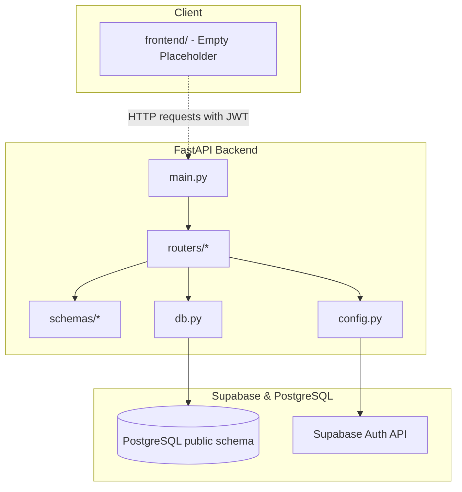

# Smart Tourist Safety - Codebase Documentation

This document serves as the canonical reference for the **Smart-Tourist-Safety** codebase, detailing the file structure, overall architecture, database relationships, API routing, configurations, and the exact current source code of all active files.

---

## 1. Complete File Tree

Below is the repository's directory structure, highlighting all relevant folders, source code, and configuration files.

```text
Smart-Tourist-Safety/
├── .gitignore
├── DATABASE.md
├── codebase.md
├── databasetobackend.md
├── README.md/
│   └── .gitkeep
├── docs/
│   └── .gitkeep
├── frontend/
│   └── .gitkeep
└── backend/
    ├── config.py
    ├── db.py
    ├── main.py
    ├── PROJECT_MEMORY.md
    ├── requirements.txt
    ├── app/ (Legacy Scaffolding)
    │   ├── api/
    │   │   └── routes/
    │   │       └── .gitkeep
    │   ├── config/
    │   │   └── .gitkeep
    │   ├── database/
    │   │   └── .gitkeep
    │   ├── models/
    │   │   └── .gitkeep
    │   ├── schemas/
    │   │   └── .gitkeep
    │   ├── services/
    │   │   └── .gitkeep
    │   └── utils/
    │       └── .gitkeep
    ├── routers/
    │   ├── alerts.py
    │   ├── auth.py
    │   ├── authority.py
    │   ├── incidents.py
    │   ├── locations.py
    │   ├── sos.py
    │   └── tourists.py
    ├── schemas/
    │   ├── alert.py
    │   ├── auth.py
    │   ├── incident.py
    │   ├── location.py
    │   ├── sos.py
    │   └── tourist.py
    └── tests/
        ├── .gitkeep
        └── test_api.py
```

*Note: The legacy folder `backend/app/` contains empty directory placeholders (`.gitkeep`). The active backend codebase lies directly under `backend/` with code organized in `routers/`, `schemas/`, and `tests/`.*

---

## 2. Project Architecture

The **Smart Tourist Safety** application is structured as a decoupled client-server architecture. The current codebase houses the complete FastAPI backend.



### Overall Execution Modes
1. **Mock Fallback Mode (Local Development)**: 
   If `DATABASE_URL` is unset or fails to connect, the backend automatically transitions to a fully offline fallback mode. Operational data (profiles, active sessions, incidents, locations, SOS requests, and alerts) is maintained in thread-safe, in-memory Python dictionaries.
2. **Production Database Mode (Supabase / PostgreSQL)**:
   If `DATABASE_URL` is set, connection pooling is initialized. Authentication credentials, tokens, and sessions are delegated to Supabase Auth API, while application transactional tables are queried directly in PostgreSQL using connection-pooled cursors.

### Row Level Security (RLS) Integration
To enforce row-level safety rules defined in the PostgreSQL database, database queries requiring authentication utilize a context manager that obtains an authenticated cursor. Inside the SQL transaction:
- The session configuration `request.jwt.claims` is set to contain `{"sub": auth_user_id, "role": "authenticated"}`.
- The PostgreSQL transaction role is set to `authenticated` using `SET LOCAL ROLE authenticated;`.

---

## 3. Database Schema

The database uses a PostgreSQL instance managed under a Supabase workspace. Row Level Security is enabled on all transactional tables.

### Tables & Columns
- **`tourists`**: Tourist profile information.
  - `tourist_id` (UUID, Primary Key)
  - `auth_user_id` (UUID, UNIQUE, Foreign Key to Supabase Auth `auth.users.id` with `ON DELETE CASCADE`)
  - `digital_id` (VARCHAR, UNIQUE)
  - `full_name` (VARCHAR)
  - `kyc_document_type` (VARCHAR, e.g., Passport, Aadhaar, Driving License, Voter ID, Other)
  - `kyc_verified` (BOOLEAN)
  - `phone` (VARCHAR)
  - `email` (VARCHAR)
  - `emergency_contact` (VARCHAR)
  - `preferred_language` (VARCHAR)
  - `created_at` (TIMESTAMPTZ)
- **`authorities`**: Emergency or civil authority information.
  - `authority_id` (UUID, Primary Key)
  - `auth_user_id` (UUID, UNIQUE, Foreign Key to `auth.users.id` with `ON DELETE CASCADE`)
  - `agency_name` (VARCHAR)
  - `jurisdiction` (VARCHAR)
  - `contact_phone` (VARCHAR)
  - `contact_email` (VARCHAR)
- **`authentication`**: Session and mapping metadata for users.
  - `auth_id` (UUID, Primary Key)
  - `auth_user_id` (UUID, UNIQUE, Foreign Key to `auth.users.id` with `ON DELETE CASCADE`)
  - `tourist_id` (UUID, Foreign Key to `tourists.tourist_id`, optional)
  - `authority_id` (UUID, Foreign Key to `authorities.authority_id`, optional)
  - `username` (VARCHAR, UNIQUE)
  - `mfa_enabled` (BOOLEAN)
  - `last_login_at` (TIMESTAMPTZ)
  - `created_at` (TIMESTAMPTZ)
- **`locations`**: Geo-location coordinates and hazard indexes.
  - `location_id` (UUID, Primary Key)
  - `name` (VARCHAR)
  - `latitude` (DECIMAL(10, 7), -90 to 90)
  - `longitude` (DECIMAL(10, 7), -180 to 180)
  - `risk_level` (VARCHAR, e.g., LOW, MEDIUM, HIGH, CRITICAL)
  - `recorded_at` (TIMESTAMPTZ)
- **`incidents`**: Tourist safety incidents.
  - `incident_id` (UUID, Primary Key)
  - `tourist_id` (UUID, Foreign Key to `tourists.tourist_id`)
  - `location_id` (UUID, Foreign Key to `locations.location_id`)
  - `incident_type` (VARCHAR, e.g., Accident, Medical, Theft, Missing Person, Harassment, Assault, Natural Disaster, Other)
  - `severity` (VARCHAR, e.g., LOW, MEDIUM, HIGH, CRITICAL)
  - `status` (VARCHAR, e.g., OPEN, ACKNOWLEDGED, RESOLVED)
  - `description` (TEXT)
  - `created_at` (TIMESTAMPTZ)
  - `authority_id` (UUID, Foreign Key to `authorities.authority_id`, optional)
- **`sos_requests`**: Emergency SOS triggers.
  - `sos_id` (UUID, Primary Key)
  - `tourist_id` (UUID, Foreign Key to `tourists.tourist_id`)
  - `incident_id` (UUID, Foreign Key to `incidents.incident_id`, optional)
  - `location_id` (UUID, Foreign Key to `locations.location_id`)
  - `authority_id` (UUID, Foreign Key to `authorities.authority_id`, optional)
  - `triggered_at` (TIMESTAMPTZ, default NOW)
  - `trigger_source` (VARCHAR, e.g., APP, WEARABLE, MANUAL, AI, SYSTEM)
  - `sos_status` (VARCHAR, e.g., ACTIVE, ACKNOWLEDGED, RESPONDING, RESOLVED, CANCELLED)
- **`alerts`**: Broad-alert notifications linked to incidents.
  - `alert_id` (UUID, Primary Key)
  - `incident_id` (UUID, Foreign Key to `incidents.incident_id`)
  - `authority_id` (UUID, Foreign Key to `authorities.authority_id`, optional)
  - `channel` (VARCHAR, e.g., SMS, PUSH, EMAIL, APP)
  - `recipient` (VARCHAR)
  - `sent_at` (TIMESTAMPTZ)

*Note: `DATABASE.md` also documents two tables with no corresponding backend implementation yet: `itinerary_entries` (a tourist's planned destinations) and `responses` (actions taken by authorities on an incident). No routers, schemas, or endpoints exist for these. See the Known Gaps section below.*

---

## 4. API & Backend Documentation

All endpoints are hosted under the prefix `/api/v1`.

### Authentication Endpoints (`/auth`)
- **`POST /auth/register`**: Registers a new user (tourist or authority). Checks Supabase config; inserts linked profiles (`tourists` or `authorities`) and authentication metadata.
- **`POST /auth/login`**: Authenticates credentials, returning an access token (JWT for Supabase Auth, UUID hex for Mock mode).
- **`POST /auth/logout`**: Stateless logout for Supabase Auth, session removal for Mock mode.
- **`GET /auth/session`**: Validates the access token in headers and returns active session parameters.

### Tourist Profile Endpoints (`/tourists`)
- **`POST /tourists`**: Creates a tourist profile.
- **`GET /tourists/{tourist_id}`**: Retrieves a specific tourist profile. Enforces RLS permissions.
- **`PATCH /tourists/{tourist_id}`**: Updates profile parameters (e.g., name, language, emergency contacts).
- **`GET /tourists/{tourist_id}/digital-id`**: Fetches the tourist's verified digital safety card.

### Location Tracker Endpoints (`/locations`)
- **`GET /locations`**: Lists geographical locations and risk levels.
- **`GET /locations/{location_id}`**: Retrieves information for a specific location.

### Incident Report Endpoints (`/incidents`)
- **`POST /incidents`**: Files a new incident. Automatically registers a location placeholder if not pre-existing.
- **`GET /incidents`**: Lists incidents. Enforces RLS (tourists only see their own incidents; authorities see all).
- **`GET /incidents/{incident_id}`**: Retrieves a specific incident.
- **`PATCH /incidents/{incident_id}`**: Updates incident properties (e.g., status, severity, description).

### Emergency SOS Endpoints (`/sos`)
- **`POST /sos`**: Activates an emergency SOS request. Creates a location, links an incident of type `'SOS'`, and registers an active SOS request atomically.

### Broadcast Alert Endpoints (`/alerts`)
- **`POST /alerts`**: Dispatches alert messages.
- **`GET /alerts`**: Retrieves broadcast alert histories.

### Authority Management Endpoints (`/authority`)
- **`POST /authority/login`**: Authenticates authority accounts.
- **`GET /authority/alerts`**: Lists alerts (accessible only to authorities).
- **`GET /authority/incidents`**: Lists incidents (accessible only to authorities).
- **`GET /authority/tourists/{tourist_id}`**: Retrieves tourist details (accessible only to authorities).
- **`GET /authority/incidents/{incident_id}/location`**: Fetches location metadata assigned to an incident (accessible only to authorities).

---

## 5. File-by-File Documentation

### 5.1 Root Configuration
- **`backend/config.py`**: Loads environment settings (Supabase credentials, JWT secrets, database links) from `.env` or system environment variables.
- **`backend/db.py`**: Manages connection pooling using `ThreadedConnectionPool`. Houses RLS authenticated transaction wrappers.
- **`backend/main.py`**: The main application entry point initializing the FastAPI routes.
- **`backend/requirements.txt`**: Declares package versions and development dependencies.

### 5.2 Schemas (`backend/schemas/`)
- **`auth.py`**: Pydantic models for register/login requests, authentication responses, and session payloads.
- **`tourist.py`**: Tourist profile validation models.
- **`location.py`**: Location coordinates, names, and risk indicators.
- **`incident.py`**: Incident updates and responses.
- **`sos.py`**: SOS emergency input parameters and response shapes.
- **`alert.py`**: Broad-channel alerts.

### 5.3 Routers (`backend/routers/`)
- **`auth.py`**: Handles OAuth/Supabase identity mappings and token extractions.
- **`tourists.py`**: Manages RLS-filtered queries to tourist profiles.
- **`locations.py`**: Manages geo-location registers.
- **`incidents.py`**: File and track incident logs.
- **`sos.py`**: High-priority SOS alarm logic.
- **`alerts.py`**: Alert broadcasting functions.
- **`authority.py`**: Administrative authority dashboards and role checks.

---

## 6. Complete Source Code

### `backend/config.py`
```python
import os
from dotenv import load_dotenv

# Load env variables from backend/.env if it exists
load_dotenv(os.path.join(os.path.dirname(__file__), ".env"))

class Config:
    DATABASE_URL = os.getenv("DATABASE_URL", "")
    SUPABASE_URL = os.getenv("SUPABASE_URL", "")
    SUPABASE_ANON_KEY = os.getenv("SUPABASE_ANON_KEY", os.getenv("SUPABASE_PUBLISHABLE_KEY", ""))
    JWT_SECRET = os.getenv("JWT_SECRET", "")
    CORS_ALLOWED_ORIGINS = [
        o.strip() for o in os.getenv("CORS_ALLOWED_ORIGINS", "").split(",") if o.strip()
    ]

    @classmethod
    def is_supabase_configured(cls) -> bool:
        return bool(cls.SUPABASE_URL and cls.SUPABASE_ANON_KEY)
```

### `backend/db.py`
```python
import json
import logging
from contextlib import contextmanager
import psycopg2
from psycopg2.pool import ThreadedConnectionPool
from config import Config

logging.basicConfig(level=logging.INFO)
logger = logging.getLogger("db")

pool = None
DB_ACTIVE = False

if Config.DATABASE_URL:
    try:
        # Initialize the threaded connection pool
        pool = ThreadedConnectionPool(
            minconn=1,
            maxconn=20,
            dsn=Config.DATABASE_URL
        )
        # Test connection
        conn = pool.getconn()
        with conn.cursor() as cur:
            cur.execute("SELECT 1;")
        pool.putconn(conn)
        DB_ACTIVE = True
        logger.info("Database connection pool initialized successfully.")
    except Exception as e:
        logger.warning(f"Failed to connect to database: {e}. Falling back to in-memory mode.")
        pool = None
        DB_ACTIVE = False
else:
    logger.info("DATABASE_URL not configured. Running in mock offline mode.")


def is_db_active() -> bool:
    return DB_ACTIVE


@contextmanager
def get_db_cursor(commit: bool = False):
    if not DB_ACTIVE or pool is None:
        raise RuntimeError("Database connection is not active.")
    conn = pool.getconn()
    cur = conn.cursor()
    try:
        yield cur
        if commit:
            conn.commit()
    except Exception as e:
        conn.rollback()
        raise e
    finally:
        cur.close()
        pool.putconn(conn)


@contextmanager
def get_authenticated_cursor(auth_user_id, commit: bool = False):
    if not DB_ACTIVE or pool is None:
        raise RuntimeError("Database connection is not active.")
    conn = pool.getconn()
    cur = conn.cursor()
    try:
        # Set JWT claims in the transaction
        claims_str = json.dumps({"sub": str(auth_user_id), "role": "authenticated"})
        cur.execute("SELECT set_config('request.jwt.claims', %s, true);", (claims_str,))
        # Set local role to authenticated
        cur.execute("SET LOCAL ROLE authenticated;")
        
        yield cur
        if commit:
            conn.commit()
    except Exception as e:
        conn.rollback()
        raise e
    finally:
        cur.close()
        pool.putconn(conn)
```

### `backend/main.py`
```python
from fastapi import FastAPI
from fastapi.middleware.cors import CORSMiddleware

from config import Config
from routers import alerts, auth, authority, incidents, locations, sos, tourists

app = FastAPI(title="Smart Tourist Safety API")

app.add_middleware(
    CORSMiddleware,
    allow_origins=Config.CORS_ALLOWED_ORIGINS,
    allow_credentials=True,
    allow_methods=["*"],
    allow_headers=["*"],
)

app.include_router(auth.router, prefix="/api/v1")
app.include_router(tourists.router, prefix="/api/v1")
app.include_router(incidents.router, prefix="/api/v1")
app.include_router(sos.router, prefix="/api/v1")
app.include_router(alerts.router, prefix="/api/v1")
app.include_router(authority.router, prefix="/api/v1")
app.include_router(locations.router, prefix="/api/v1")
```

### `backend/requirements.txt`
```text
fastapi
uvicorn[standard]
psycopg2-binary
python-dotenv
pyjwt
requests
cryptography
pytest
httpx
```

### `backend/routers/auth.py`
```python
import hashlib
import logging
import secrets
from datetime import datetime, timezone
import json
import requests
import jwt
from uuid import UUID, uuid4

from fastapi import APIRouter, Depends, Header, HTTPException, status

from config import Config
from db import is_db_active, get_db_cursor, get_authenticated_cursor
from schemas.auth import (
    AuthResponse,
    LoginRequest,
    LoginResponse,
    RegisterRequest,
    SessionResponse,
)

logger = logging.getLogger("auth")
router = APIRouter(prefix="/auth", tags=["auth"])

# Temporary in-memory stores for authentication records and active sessions (fallback mode).
_in_memory_auth_store: dict[UUID, dict] = {}
_in_memory_session_store: dict[str, dict] = {}


def _get_email_from_username(username: str) -> str:
    if "@" in username:
        return username
    return f"{username}@smarttouristsafety.com"


def _hash_password(password: str, salt: str | None = None) -> str:
    if salt is None:
        salt = secrets.token_hex(16)
    key = hashlib.pbkdf2_hmac(
        "sha256",
        password.encode("utf-8"),
        salt.encode("utf-8"),
        100000,
    )
    return f"{salt}${key.hex()}"


def _verify_password(password: str, password_hash: str) -> bool:
    try:
        salt, key_hex = password_hash.split("$")
        recalculated = hashlib.pbkdf2_hmac(
            "sha256",
            password.encode("utf-8"),
            salt.encode("utf-8"),
            100000,
        ).hex()
        return secrets.compare_digest(recalculated, key_hex)
    except Exception:
        return False


def get_current_user(
    authorization: str | None = Header(None),
    x_session_token: str | None = Header(None, alias="X-Session-Token"),
) -> SessionResponse:
    token = None
    if authorization:
        if authorization.lower().startswith("bearer "):
            token = authorization.split(" ", 1)[1].strip()
        else:
            token = authorization.strip()
    elif x_session_token:
        token = x_session_token.strip()

    if not token:
        raise HTTPException(
            status_code=status.HTTP_401_UNAUTHORIZED,
            detail="Authentication token required",
            headers={"WWW-Authenticate": "Bearer"},
        )

    # 1. Fallback / Mock Mode
    if not is_db_active():
        session_data = _in_memory_session_store.get(token)
        if not session_data:
            raise HTTPException(
                status_code=status.HTTP_401_UNAUTHORIZED,
                detail="Invalid or expired session token",
                headers={"WWW-Authenticate": "Bearer"},
            )
        return SessionResponse(**session_data)

    # 2. Database Mode: JWT Session Decoding
    try:
        if Config.JWT_SECRET:
            claims = jwt.decode(
                token,
                Config.JWT_SECRET,
                algorithms=["HS256"],
                options={"verify_aud": False}
            )
        else:
            claims = jwt.decode(token, options={"verify_signature": False})
        
        auth_user_id = claims.get("sub")
        if not auth_user_id:
            raise HTTPException(
                status_code=status.HTTP_401_UNAUTHORIZED,
                detail="Invalid token payload: missing sub claim",
            )
        
        # Look up authentication and profiles in DB
        with get_db_cursor() as cur:
            cur.execute("""
                SELECT auth_id, auth_user_id, tourist_id, authority_id, username, mfa_enabled, last_login_at
                FROM public.authentication
                WHERE auth_user_id = %s;
            """, (auth_user_id,))
            row = cur.fetchone()
            if not row:
                raise HTTPException(
                    status_code=status.HTTP_401_UNAUTHORIZED,
                    detail="User profile not found in database",
                )
            
            user_type = "tourist" if row[2] is not None else "authority"
            return SessionResponse(
                auth_id=row[0],
                auth_user_id=row[1],
                username=row[4],
                user_type=user_type,
                tourist_id=row[2],
                authority_id=row[3],
                mfa_enabled=row[5],
                last_login_at=row[6],
            )
            
    except jwt.PyJWTError as jwt_err:
        logger.warning(f"JWT decode error: {jwt_err}")
        raise HTTPException(
            status_code=status.HTTP_401_UNAUTHORIZED,
            detail="Invalid or expired authentication token",
            headers={"WWW-Authenticate": "Bearer"},
        )
    except Exception as e:
        logger.error(f"Error in session verification: {e}")
        if isinstance(e, HTTPException):
            raise e
        raise HTTPException(
            status_code=status.HTTP_500_INTERNAL_SERVER_ERROR,
            detail="Internal server error during authentication",
        )


def require_authority(
    current_user: SessionResponse = Depends(get_current_user),
) -> SessionResponse:
    if current_user.user_type != "authority" or current_user.authority_id is None:
        raise HTTPException(
            status_code=status.HTTP_403_FORBIDDEN,
            detail="Authority access required",
        )
    return current_user


def require_tourist(
    current_user: SessionResponse = Depends(get_current_user),
) -> SessionResponse:
    if current_user.user_type != "tourist" or current_user.tourist_id is None:
        raise HTTPException(
            status_code=status.HTTP_403_FORBIDDEN,
            detail="Tourist access required",
        )
    return current_user


@router.post("/register", response_model=AuthResponse, status_code=status.HTTP_201_CREATED)
def register(payload: RegisterRequest) -> AuthResponse:
    user_type = payload.user_type.lower()
    if user_type not in ("tourist", "authority"):
        raise HTTPException(
            status_code=status.HTTP_400_BAD_REQUEST,
            detail="User type must be 'tourist' or 'authority'",
        )

    # 1. Fallback / Mock Mode
    if not is_db_active():
        for record in _in_memory_auth_store.values():
            if record["username"].lower() == payload.username.lower():
                raise HTTPException(
                    status_code=status.HTTP_409_CONFLICT,
                    detail="Username already registered",
                )

        now = datetime.now(timezone.utc)
        auth_id = uuid4()
        auth_user_id = uuid4()
        tourist_id = payload.tourist_id if user_type == "tourist" else None
        if user_type == "tourist" and not tourist_id:
            tourist_id = uuid4()
            
        authority_id = payload.authority_id if user_type == "authority" else None
        if user_type == "authority" and not authority_id:
            authority_id = uuid4()

        # Seed local tourist store to allow profile queries immediately
        if user_type == "tourist":
            from routers.tourists import _in_memory_tourist_store
            from schemas.tourist import TouristResponse
            _in_memory_tourist_store[tourist_id] = TouristResponse(
                tourist_id=tourist_id,
                digital_id=f"DIG-{uuid4().hex[:8].upper()}",
                full_name=payload.username,
                kyc_document_type=None,
                kyc_verified=False,
                phone=None,
                email=f"{payload.username}@smarttouristsafety.com",
                emergency_contact=None,
                preferred_language="EN",
                created_at=now
            )

        auth_record = {
            "auth_id": auth_id,
            "auth_user_id": auth_user_id,
            "tourist_id": tourist_id,
            "authority_id": authority_id,
            "username": payload.username,
            "password_hash": _hash_password(payload.password),
            "user_type": user_type,
            "mfa_enabled": payload.mfa_enabled,
            "last_login_at": None,
            "created_at": now,
        }
        _in_memory_auth_store[auth_id] = auth_record

        return AuthResponse(
            auth_id=auth_record["auth_id"],
            tourist_id=auth_record["tourist_id"],
            authority_id=auth_record["authority_id"],
            username=auth_record["username"],
            user_type=auth_record["user_type"],
            mfa_enabled=auth_record["mfa_enabled"],
            last_login_at=auth_record["last_login_at"],
            created_at=auth_record["created_at"],
        )

    # 2. Database Mode: Supabase Auth Signup + Profile Creation
    email_str = _get_email_from_username(payload.username)
    
    # Sign up via Supabase Auth API
    if not Config.is_supabase_configured():
        raise HTTPException(
            status_code=status.HTTP_500_INTERNAL_SERVER_ERROR,
            detail="Supabase is not configured on the backend.",
        )
        
    signup_url = f"{Config.SUPABASE_URL}/auth/v1/signup"
    headers = {
        "apikey": Config.SUPABASE_ANON_KEY,
        "Content-Type": "application/json"
    }
    body = {
        "email": email_str,
        "password": payload.password
    }
    
    try:
        resp = requests.post(signup_url, headers=headers, json=body, timeout=10)
        if resp.status_code != 200:
            err_detail = resp.json().get("msg", "Failed to sign up with Supabase Auth.")
            raise HTTPException(
                status_code=resp.status_code,
                detail=err_detail
            )
        
        sb_user = resp.json().get("user", {})
        auth_user_id = sb_user.get("id")
        if not auth_user_id:
            raise HTTPException(
                status_code=status.HTTP_500_INTERNAL_SERVER_ERROR,
                detail="Supabase Auth did not return a user ID.",
            )
            
        now = datetime.now(timezone.utc)
        auth_id = uuid4()
        tourist_id = payload.tourist_id if user_type == "tourist" else None
        authority_id = payload.authority_id if user_type == "authority" else None
        
        # Insert profile into tourists or authorities table, and authentication table
        with get_db_cursor(commit=True) as cur:
            if user_type == "tourist":
                if not tourist_id:
                    tourist_id = uuid4()
                digital_id = f"DIG-{uuid4().hex[:8].upper()}"
                cur.execute("""
                    INSERT INTO public.tourists (tourist_id, auth_user_id, digital_id, full_name, email, kyc_verified, created_at)
                    VALUES (%s, %s, %s, %s, %s, %s, %s);
                """, (tourist_id, auth_user_id, digital_id, payload.username, email_str, False, now))
            else:
                if not authority_id:
                    authority_id = uuid4()
                cur.execute("""
                    INSERT INTO public.authorities (authority_id, auth_user_id, agency_name, contact_email)
                    VALUES (%s, %s, %s, %s);
                """, (authority_id, auth_user_id, payload.username, email_str))
                
            cur.execute("""
                INSERT INTO public.authentication (auth_id, auth_user_id, tourist_id, authority_id, username, mfa_enabled, created_at)
                VALUES (%s, %s, %s, %s, %s, %s, %s);
            """, (auth_id, auth_user_id, tourist_id, authority_id, payload.username, payload.mfa_enabled, now))
            
        return AuthResponse(
            auth_id=auth_id,
            tourist_id=tourist_id,
            authority_id=authority_id,
            username=payload.username,
            user_type=user_type,
            mfa_enabled=payload.mfa_enabled,
            last_login_at=None,
            created_at=now,
        )
        
    except Exception as e:
        logger.error(f"Registration database error: {e}")
        if isinstance(e, HTTPException):
            raise e
        raise HTTPException(
            status_code=status.HTTP_500_INTERNAL_SERVER_ERROR,
            detail=f"Registration failed: {str(e)}"
        )


@router.post("/login", response_model=LoginResponse)
def login(payload: LoginRequest) -> LoginResponse:
    # 1. Fallback / Mock Mode
    if not is_db_active():
        target_record = None
        for record in _in_memory_auth_store.values():
            if record["username"].lower() == payload.username.lower():
                target_record = record
                break

        if not target_record or not _verify_password(payload.password, target_record["password_hash"]):
            raise HTTPException(
                status_code=status.HTTP_401_UNAUTHORIZED,
                detail="Invalid username or password",
            )

        now = datetime.now(timezone.utc)
        target_record["last_login_at"] = now

        token = secrets.token_hex(32)
        session_info = {
            "auth_id": target_record["auth_id"],
            "auth_user_id": target_record["auth_user_id"],
            "username": target_record["username"],
            "user_type": target_record["user_type"],
            "tourist_id": target_record["tourist_id"],
            "authority_id": target_record["authority_id"],
            "mfa_enabled": target_record["mfa_enabled"],
            "last_login_at": now,
        }
        _in_memory_session_store[token] = session_info

        return LoginResponse(
            access_token=token,
            token_type="bearer",
            auth_id=target_record["auth_id"],
            username=target_record["username"],
            user_type=target_record["user_type"],
            tourist_id=target_record["tourist_id"],
            authority_id=target_record["authority_id"],
            mfa_enabled=target_record["mfa_enabled"],
            last_login_at=now,
        )

    # 2. Database Mode: Supabase Auth Login + last_login_at update
    if not Config.is_supabase_configured():
        raise HTTPException(
            status_code=status.HTTP_500_INTERNAL_SERVER_ERROR,
            detail="Supabase is not configured on the backend.",
        )
        
    email_str = _get_email_from_username(payload.username)
    login_url = f"{Config.SUPABASE_URL}/auth/v1/token?grant_type=password"
    headers = {
        "apikey": Config.SUPABASE_ANON_KEY,
        "Content-Type": "application/json"
    }
    body = {
        "email": email_str,
        "password": payload.password
    }
    
    try:
        resp = requests.post(login_url, headers=headers, json=body, timeout=10)
        if resp.status_code != 200:
            raise HTTPException(
                status_code=status.HTTP_401_UNAUTHORIZED,
                detail="Invalid username or password",
            )
            
        data = resp.json()
        access_token = data.get("access_token")
        sb_user = data.get("user", {})
        auth_user_id = sb_user.get("id")
        
        now = datetime.now(timezone.utc)
        
        # Retrieve profile mapping and update last login time
        with get_db_cursor(commit=True) as cur:
            cur.execute("""
                SELECT auth_id, auth_user_id, tourist_id, authority_id, username, mfa_enabled
                FROM public.authentication
                WHERE auth_user_id = %s;
            """, (auth_user_id,))
            row = cur.fetchone()
            if not row:
                raise HTTPException(
                    status_code=status.HTTP_401_UNAUTHORIZED,
                    detail="Linked profile not found in application database.",
                )
                
            cur.execute("""
                UPDATE public.authentication
                SET last_login_at = %s
                WHERE auth_user_id = %s;
            """, (now, auth_user_id))
            
            user_type = "tourist" if row[2] is not None else "authority"
            
            return LoginResponse(
                access_token=access_token,
                token_type="bearer",
                auth_id=row[0],
                username=row[4],
                user_type=user_type,
                tourist_id=row[2],
                authority_id=row[3],
                mfa_enabled=row[5],
                last_login_at=now,
            )
            
    except Exception as e:
        logger.error(f"Login database error: {e}")
        if isinstance(e, HTTPException):
            raise e
        raise HTTPException(
            status_code=status.HTTP_500_INTERNAL_SERVER_ERROR,
            detail=f"Login failed: {str(e)}"
        )


@router.post("/logout")
def logout(
    authorization: str | None = Header(None),
    x_session_token: str | None = Header(None, alias="X-Session-Token"),
) -> dict:
    token = None
    if authorization:
        if authorization.lower().startswith("bearer "):
            token = authorization.split(" ", 1)[1].strip()
        else:
            token = authorization.strip()
    elif x_session_token:
        token = x_session_token.strip()

    if not is_db_active():
        if token and token in _in_memory_session_store:
            del _in_memory_session_store[token]
    else:
        # For Supabase, the client normally clears the token. 
        # Server side logout is stateless unless we call Supabase logout API.
        if token and Config.is_supabase_configured():
            logout_url = f"{Config.SUPABASE_URL}/auth/v1/logout"
            headers = {
                "apikey": Config.SUPABASE_ANON_KEY,
                "Authorization": f"Bearer {token}"
            }
            try:
                requests.post(logout_url, headers=headers, timeout=5)
            except Exception as e:
                logger.warning(f"Failed to logout from Supabase: {e}")

    return {"message": "logged out"}


@router.get("/session", response_model=SessionResponse)
def get_session(current_user: SessionResponse = Depends(get_current_user)) -> SessionResponse:
    return current_user
```

### `backend/routers/tourists.py`
```python
from datetime import datetime, timezone
from uuid import UUID, uuid4

from fastapi import APIRouter, Depends, HTTPException, status

from db import is_db_active, get_db_cursor, get_authenticated_cursor
from routers.auth import get_current_user
from schemas.auth import SessionResponse
from schemas.tourist import DigitalIdResponse, TouristCreate, TouristResponse, TouristUpdate

router = APIRouter(prefix="/tourists", tags=["tourists"])

# Temporary in-memory storage for local API development only (fallback).
_in_memory_tourist_store: dict[UUID, TouristResponse] = {}


def _get_tourist_or_404(tourist_id: UUID, current_user: SessionResponse | None = None) -> TouristResponse:
    # 1. Fallback Mode
    if not is_db_active():
        tourist = _in_memory_tourist_store.get(tourist_id)
        if tourist is None:
            raise HTTPException(
                status_code=status.HTTP_404_NOT_FOUND,
                detail="Tourist not found",
            )
        return tourist

    # 2. Database Mode
    # If a current user is present, use their authenticated cursor (RLS policy applies).
    # Otherwise, fallback to system db cursor (e.g. for registration or system actions).
    try:
        if current_user and current_user.user_type == "tourist":
            cursor_ctx = get_authenticated_cursor(current_user.auth_user_id)
        else:
            cursor_ctx = get_db_cursor()
            
        with cursor_ctx as cur:
            cur.execute("""
                SELECT tourist_id, digital_id, full_name, kyc_document_type, kyc_verified, phone, email, emergency_contact, preferred_language, created_at
                FROM public.tourists
                WHERE tourist_id = %s;
            """, (tourist_id,))
            row = cur.fetchone()
            if not row:
                raise HTTPException(
                    status_code=status.HTTP_404_NOT_FOUND,
                    detail="Tourist profile not found",
                )
            return TouristResponse(
                tourist_id=row[0],
                digital_id=row[1],
                full_name=row[2],
                kyc_document_type=row[3],
                kyc_verified=row[4],
                phone=row[5],
                email=row[6],
                emergency_contact=row[7],
                preferred_language=row[8],
                created_at=row[9]
            )
    except HTTPException as he:
        raise he
    except Exception as e:
        raise HTTPException(
            status_code=status.HTTP_500_INTERNAL_SERVER_ERROR,
            detail=f"Database query failed: {str(e)}"
        )


@router.post("", response_model=TouristResponse, status_code=status.HTTP_201_CREATED)
def create_tourist(
    payload: TouristCreate,
    current_user: SessionResponse = Depends(get_current_user)
) -> TouristResponse:
    # 1. Fallback Mode
    if not is_db_active():
        tourist = TouristResponse(
            tourist_id=uuid4(),
            digital_id=payload.digital_id,
            full_name=payload.full_name,
            kyc_document_type=payload.kyc_document_type,
            kyc_verified=payload.kyc_verified,
            phone=payload.phone,
            email=payload.email,
            emergency_contact=payload.emergency_contact,
            preferred_language=payload.preferred_language,
            created_at=datetime.now(timezone.utc),
        )
        _in_memory_tourist_store[tourist.tourist_id] = tourist
        return tourist

    # 2. Database Mode
    now = datetime.now(timezone.utc)
    tourist_id = uuid4()
    digital_id = payload.digital_id or f"DIG-{uuid4().hex[:8].upper()}"
    
    try:
        # Run under the current user's authenticated transaction
        with get_authenticated_cursor(current_user.auth_user_id, commit=True) as cur:
            cur.execute("""
                INSERT INTO public.tourists (
                    tourist_id, auth_user_id, digital_id, full_name, kyc_document_type, 
                    kyc_verified, phone, email, emergency_contact, preferred_language, created_at
                ) VALUES (%s, %s, %s, %s, %s, %s, %s, %s, %s, %s, %s)
                RETURNING tourist_id, digital_id, full_name, kyc_document_type, kyc_verified, phone, email, emergency_contact, preferred_language, created_at;
            """, (
                tourist_id, current_user.auth_user_id, digital_id, payload.full_name, payload.kyc_document_type,
                payload.kyc_verified or False, payload.phone, payload.email, payload.emergency_contact, payload.preferred_language, now
            ))
            row = cur.fetchone()
            
            # Map this profile to authentication table as well if needed
            cur.execute("""
                UPDATE public.authentication
                SET tourist_id = %s
                WHERE auth_user_id = %s;
            """, (tourist_id, current_user.auth_user_id))
            
            return TouristResponse(
                tourist_id=row[0],
                digital_id=row[1],
                full_name=row[2],
                kyc_document_type=row[3],
                kyc_verified=row[4],
                phone=row[5],
                email=row[6],
                emergency_contact=row[7],
                preferred_language=row[8],
                created_at=row[9]
            )
    except Exception as e:
        raise HTTPException(
            status_code=status.HTTP_500_INTERNAL_SERVER_ERROR,
            detail=f"Failed to create tourist profile: {str(e)}"
        )


@router.get("/{tourist_id}", response_model=TouristResponse)
def get_tourist(
    tourist_id: UUID,
    current_user: SessionResponse = Depends(get_current_user)
) -> TouristResponse:
    return _get_tourist_or_404(tourist_id, current_user)


@router.get("/{tourist_id}/digital-id", response_model=DigitalIdResponse)
def get_tourist_digital_id(
    tourist_id: UUID,
    current_user: SessionResponse = Depends(get_current_user)
) -> DigitalIdResponse:
    tourist = _get_tourist_or_404(tourist_id, current_user)
    return DigitalIdResponse.model_validate(tourist)


@router.patch("/{tourist_id}", response_model=TouristResponse)
def update_tourist(
    tourist_id: UUID,
    payload: TouristUpdate,
    current_user: SessionResponse = Depends(get_current_user)
) -> TouristResponse:
    # 1. Fallback Mode
    if not is_db_active():
        tourist = _get_tourist_or_404(tourist_id)
        update_data = payload.model_dump(exclude_unset=True)
        updated = tourist.model_copy(update=update_data)
        _in_memory_tourist_store[tourist_id] = updated
        return updated

    # 2. Database Mode
    _get_tourist_or_404(tourist_id, current_user)  # Verify existence and RLS permission first
    
    update_data = payload.model_dump(exclude_unset=True)
    if not update_data:
        return _get_tourist_or_404(tourist_id, current_user)
        
    set_clauses = []
    params = []
    for k, v in update_data.items():
        set_clauses.append(f"{k} = %s")
        params.append(v)
        
    params.append(tourist_id)
    query = f"UPDATE public.tourists SET {', '.join(set_clauses)} WHERE tourist_id = %s RETURNING tourist_id, digital_id, full_name, kyc_document_type, kyc_verified, phone, email, emergency_contact, preferred_language, created_at;"
    
    try:
        with get_authenticated_cursor(current_user.auth_user_id, commit=True) as cur:
            cur.execute(query, tuple(params))
            row = cur.fetchone()
            return TouristResponse(
                tourist_id=row[0],
                digital_id=row[1],
                full_name=row[2],
                kyc_document_type=row[3],
                kyc_verified=row[4],
                phone=row[5],
                email=row[6],
                emergency_contact=row[7],
                preferred_language=row[8],
                created_at=row[9]
            )
    except Exception as e:
        raise HTTPException(
            status_code=status.HTTP_500_INTERNAL_SERVER_ERROR,
            detail=f"Failed to update tourist profile: {str(e)}"
        )
```

### `backend/routers/locations.py`
```python
from uuid import UUID
from datetime import datetime, timezone
from fastapi import APIRouter, HTTPException, status, Depends

from db import is_db_active, get_authenticated_cursor
from routers.auth import get_current_user
from schemas.auth import SessionResponse
from schemas.location import LocationResponse

router = APIRouter(prefix="/locations", tags=["locations"])

# Temporary in-memory location storage for local API development only (fallback).
_in_memory_location_store: dict[UUID, LocationResponse] = {}


def _get_location_or_404(location_id: UUID, current_user: SessionResponse) -> LocationResponse:
    # 1. Fallback Mode
    if not is_db_active():
        location = _in_memory_location_store.get(location_id)
        if location is None:
            raise HTTPException(
                status_code=status.HTTP_404_NOT_FOUND,
                detail="Location not found",
            )
        return location

    # 2. Database Mode
    try:
        with get_authenticated_cursor(current_user.auth_user_id) as cur:
            cur.execute("""
                SELECT location_id, name, latitude, longitude, risk_level, recorded_at
                FROM public.locations
                WHERE location_id = %s;
            """, (location_id,))
            row = cur.fetchone()
            if not row:
                raise HTTPException(
                    status_code=status.HTTP_404_NOT_FOUND,
                    detail="Location not found",
                )
            return LocationResponse(
                location_id=row[0],
                name=row[1],
                latitude=float(row[2]) if row[2] is not None else None,
                longitude=float(row[3]) if row[3] is not None else None,
                risk_level=row[4],
                recorded_at=row[5]
            )
    except HTTPException as he:
        raise he
    except Exception as e:
        raise HTTPException(
            status_code=status.HTTP_500_INTERNAL_SERVER_ERROR,
            detail=f"Database query failed: {str(e)}"
        )


@router.get("", response_model=list[LocationResponse])
def list_locations(current_user: SessionResponse = Depends(get_current_user)) -> list[LocationResponse]:
    # 1. Fallback Mode
    if not is_db_active():
        return list(_in_memory_location_store.values())

    # 2. Database Mode
    try:
        with get_authenticated_cursor(current_user.auth_user_id) as cur:
            cur.execute("""
                SELECT location_id, name, latitude, longitude, risk_level, recorded_at
                FROM public.locations
                ORDER BY recorded_at DESC;
            """)
            rows = cur.fetchall()
            return [
                LocationResponse(
                    location_id=row[0],
                    name=row[1],
                    latitude=float(row[2]) if row[2] is not None else None,
                    longitude=float(row[3]) if row[3] is not None else None,
                    risk_level=row[4],
                    recorded_at=row[5]
                )
                for row in rows
            ]
    except Exception as e:
        raise HTTPException(
            status_code=status.HTTP_500_INTERNAL_SERVER_ERROR,
            detail=f"Failed to retrieve locations: {str(e)}"
        )


@router.get("/{location_id}", response_model=LocationResponse)
def get_location(
    location_id: UUID,
    current_user: SessionResponse = Depends(get_current_user)
) -> LocationResponse:
    return _get_location_or_404(location_id, current_user)
```

### `backend/routers/incidents.py`
```python
from datetime import datetime, timezone
from uuid import UUID, uuid4

from fastapi import APIRouter, Depends, HTTPException, Query, status

from db import is_db_active, get_db_cursor, get_authenticated_cursor
from routers.auth import get_current_user
from schemas.auth import SessionResponse
from schemas.incident import IncidentCreate, IncidentResponse, IncidentUpdate
from schemas.location import LocationResponse

router = APIRouter(prefix="/incidents", tags=["incidents"])

# Temporary in-memory storage for local API development only (fallback).
_in_memory_incident_store: dict[UUID, IncidentResponse] = {}


def _get_incident_or_404(incident_id: UUID, current_user: SessionResponse | None = None) -> IncidentResponse:
    # 1. Fallback Mode
    if not is_db_active():
        incident = _in_memory_incident_store.get(incident_id)
        if incident is None:
            raise HTTPException(
                status_code=status.HTTP_404_NOT_FOUND,
                detail="Incident not found",
            )
        return incident

    # 2. Database Mode
    try:
        if current_user:
            cursor_ctx = get_authenticated_cursor(current_user.auth_user_id)
        else:
            cursor_ctx = get_db_cursor()
            
        with cursor_ctx as cur:
            cur.execute("""
                SELECT incident_id, tourist_id, location_id, incident_type, severity, status, description, created_at, authority_id
                FROM public.incidents
                WHERE incident_id = %s;
            """, (incident_id,))
            row = cur.fetchone()
            if not row:
                raise HTTPException(
                    status_code=status.HTTP_404_NOT_FOUND,
                    detail="Incident not found",
                )
            return IncidentResponse(
                incident_id=row[0],
                tourist_id=row[1],
                location_id=row[2],
                incident_type=row[3],
                severity=row[4],
                status=row[5],
                description=row[6],
                created_at=row[7],
                authority_id=row[8]
            )
    except HTTPException as he:
        raise he
    except Exception as e:
        raise HTTPException(
            status_code=status.HTTP_500_INTERNAL_SERVER_ERROR,
            detail=f"Database query failed: {str(e)}"
        )


@router.post("", response_model=IncidentResponse, status_code=status.HTTP_201_CREATED)
def create_incident(
    payload: IncidentCreate,
    current_user: SessionResponse = Depends(get_current_user)
) -> IncidentResponse:
    # 1. Fallback Mode
    if not is_db_active():
        from routers.tourists import _get_tourist_or_404
        from routers.locations import _in_memory_location_store
        
        _get_tourist_or_404(payload.tourist_id)

        now = datetime.now(timezone.utc)
        if payload.location_id is not None and payload.location_id not in _in_memory_location_store:
            _in_memory_location_store[payload.location_id] = LocationResponse(
                location_id=payload.location_id,
                recorded_at=now,
            )

        incident = IncidentResponse(
            incident_id=uuid4(),
            tourist_id=payload.tourist_id,
            location_id=payload.location_id,
            incident_type=payload.incident_type or "OTHER",
            severity=payload.severity or "MEDIUM",
            status=payload.status or "OPEN",
            description=payload.description,
            created_at=now,
            authority_id=payload.authority_id,
        )
        _in_memory_incident_store[incident.incident_id] = incident
        return incident

    # 2. Database Mode
    now = datetime.now(timezone.utc)
    incident_id = uuid4()
    
    try:
        with get_authenticated_cursor(current_user.auth_user_id, commit=True) as cur:
            # Verify tourist profile exists
            cur.execute("SELECT tourist_id FROM public.tourists WHERE tourist_id = %s;", (payload.tourist_id,))
            if not cur.fetchone():
                raise HTTPException(
                    status_code=status.HTTP_404_NOT_FOUND,
                    detail="Tourist profile not found",
                )
                
            # Verify location exists, or resolve/create one — incidents.location_id is NOT NULL
            loc_id = payload.location_id
            if loc_id:
                cur.execute("SELECT location_id FROM public.locations WHERE location_id = %s;", (loc_id,))
                if not cur.fetchone():
                    # Generate automatic location entry
                    cur.execute("""
                        INSERT INTO public.locations (location_id, name, latitude, longitude, risk_level, recorded_at)
                        VALUES (%s, %s, %s, %s, %s, %s);
                    """, (loc_id, "Geocoded Tourist Incident Location", 0.0, 0.0, "LOW", now))
            else:
                # No location_id provided — create one from supplied coordinates (or a default placeholder)
                loc_id = uuid4()
                cur.execute("""
                    INSERT INTO public.locations (location_id, name, latitude, longitude, risk_level, recorded_at)
                    VALUES (%s, %s, %s, %s, %s, %s);
                """, (
                    loc_id, "Geocoded Tourist Incident Location",
                    payload.latitude if payload.latitude is not None else 0.0,
                    payload.longitude if payload.longitude is not None else 0.0,
                    "LOW", now
                ))
            
            cur.execute("""
                INSERT INTO public.incidents (incident_id, tourist_id, location_id, incident_type, severity, status, description, created_at, authority_id)
                VALUES (%s, %s, %s, %s, %s, %s, %s, %s, %s)
                RETURNING incident_id, tourist_id, location_id, incident_type, severity, status, description, created_at, authority_id;
            """, (
                incident_id, payload.tourist_id, loc_id, payload.incident_type or "OTHER",
                payload.severity or "MEDIUM", payload.status or "OPEN", payload.description, now, payload.authority_id
            ))
            row = cur.fetchone()
            return IncidentResponse(
                incident_id=row[0],
                tourist_id=row[1],
                location_id=row[2],
                incident_type=row[3],
                severity=row[4],
                status=row[5],
                description=row[6],
                created_at=row[7],
                authority_id=row[8]
            )
    except HTTPException as he:
        raise he
    except Exception as e:
        raise HTTPException(
            status_code=status.HTTP_500_INTERNAL_SERVER_ERROR,
            detail=f"Failed to create incident: {str(e)}"
        )


@router.get("", response_model=list[IncidentResponse])
def list_incidents(
    status_filter: str | None = Query(default=None, alias="status"),
    current_user: SessionResponse = Depends(get_current_user)
) -> list[IncidentResponse]:
    # 1. Fallback Mode
    if not is_db_active():
        incidents = list(_in_memory_incident_store.values())
        if status_filter is not None:
            incidents = [i for i in incidents if i.status.lower() == status_filter.lower()]
        return incidents

    # 2. Database Mode
    try:
        # Run using user authenticated cursor so RLS policies automatically filter incidents
        with get_authenticated_cursor(current_user.auth_user_id) as cur:
            if status_filter:
                cur.execute("""
                    SELECT incident_id, tourist_id, location_id, incident_type, severity, status, description, created_at, authority_id
                    FROM public.incidents
                    WHERE status = %s;
                """, (status_filter,))
            else:
                cur.execute("""
                    SELECT incident_id, tourist_id, location_id, incident_type, severity, status, description, created_at, authority_id
                    FROM public.incidents;
                """)
                
            rows = cur.fetchall()
            return [
                IncidentResponse(
                    incident_id=row[0],
                    tourist_id=row[1],
                    location_id=row[2],
                    incident_type=row[3],
                    severity=row[4],
                    status=row[5],
                    description=row[6],
                    created_at=row[7],
                    authority_id=row[8]
                )
                for row in rows
            ]
    except Exception as e:
        raise HTTPException(
            status_code=status.HTTP_500_INTERNAL_SERVER_ERROR,
            detail=f"Failed to retrieve incidents: {str(e)}"
        )


@router.get("/{incident_id}", response_model=IncidentResponse)
def get_incident(
    incident_id: UUID,
    current_user: SessionResponse = Depends(get_current_user)
) -> IncidentResponse:
    return _get_incident_or_404(incident_id, current_user)


@router.patch("/{incident_id}", response_model=IncidentResponse)
def update_incident(
    incident_id: UUID,
    payload: IncidentUpdate,
    current_user: SessionResponse = Depends(get_current_user)
) -> IncidentResponse:
    # 1. Fallback Mode
    if not is_db_active():
        incident = _get_incident_or_404(incident_id)
        update_data = payload.model_dump(exclude_unset=True)
        updated = incident.model_copy(update=update_data)
        _in_memory_incident_store[incident_id] = updated
        return updated

    # 2. Database Mode
    _get_incident_or_404(incident_id, current_user) # Verify existence/RLS permissions first
    
    update_data = payload.model_dump(exclude_unset=True)
    if not update_data:
        return _get_incident_or_404(incident_id, current_user)
        
    set_clauses = []
    params = []
    for k, v in update_data.items():
        set_clauses.append(f"{k} = %s")
        params.append(v)
        
    params.append(incident_id)
    query = f"UPDATE public.incidents SET {', '.join(set_clauses)} WHERE incident_id = %s RETURNING incident_id, tourist_id, location_id, incident_type, severity, status, description, created_at, authority_id;"
    
    try:
        with get_authenticated_cursor(current_user.auth_user_id, commit=True) as cur:
            cur.execute(query, tuple(params))
            row = cur.fetchone()
            if not row:
                raise HTTPException(
                    status_code=status.HTTP_404_NOT_FOUND,
                    detail="Incident not found or unauthorized to update",
                )
            return IncidentResponse(
                incident_id=row[0],
                tourist_id=row[1],
                location_id=row[2],
                incident_type=row[3],
                severity=row[4],
                status=row[5],
                description=row[6],
                created_at=row[7],
                authority_id=row[8]
            )
    except HTTPException as he:
        raise he
    except Exception as e:
        raise HTTPException(
            status_code=status.HTTP_500_INTERNAL_SERVER_ERROR,
            detail=f"Failed to update incident: {str(e)}"
        )
```

### `backend/routers/sos.py`
```python
from datetime import datetime, timezone
from uuid import UUID, uuid4

from fastapi import APIRouter, Depends, HTTPException, status

from db import is_db_active, get_db_cursor, get_authenticated_cursor
from routers.auth import get_current_user
from schemas.auth import SessionResponse
from schemas.incident import IncidentResponse
from schemas.location import LocationResponse
from schemas.sos import SOSCreate, SOSResponse

router = APIRouter(prefix="/sos", tags=["sos"])

# Temporary in-memory storage for local API development only (fallback).
_in_memory_sos_store: dict[UUID, SOSResponse] = {}


@router.post("", response_model=SOSResponse, status_code=status.HTTP_201_CREATED)
def create_sos(
    payload: SOSCreate,
    current_user: SessionResponse = Depends(get_current_user)
) -> SOSResponse:
    # 1. Fallback Mode
    if not is_db_active():
        from routers.tourists import _get_tourist_or_404
        from routers.incidents import _in_memory_incident_store
        from routers.locations import _in_memory_location_store
        
        _get_tourist_or_404(payload.tourist_id)

        now = datetime.now(timezone.utc)
        location_id = uuid4()
        location = LocationResponse(
            location_id=location_id,
            name=f"SOS Alarm - {payload.tourist_id}",
            latitude=payload.latitude,
            longitude=payload.longitude,
            risk_level="HIGH",
            recorded_at=now,
        )
        _in_memory_location_store[location_id] = location

        incident_id = uuid4()
        incident = IncidentResponse(
            incident_id=incident_id,
            tourist_id=payload.tourist_id,
            location_id=location_id,
            incident_type="SOS",
            severity="HIGH",
            status="OPEN",
            description="SOS Alarm Triggered",
            created_at=now,
            authority_id=None,
        )
        _in_memory_incident_store[incident_id] = incident

        sos = SOSResponse(
            sos_id=uuid4(),
            tourist_id=payload.tourist_id,
            incident_id=incident_id,
            location_id=location_id,
            incident_type="SOS",
            severity="HIGH",
            status="OPEN",
            description="SOS Alarm Triggered",
            triggered_at=now,
            created_at=now,
            trigger_source=payload.trigger_source or "APP",
            sos_status="ACTIVE"
        )
        _in_memory_sos_store[sos.sos_id] = sos
        return sos

    # 2. Database Mode
    now = datetime.now(timezone.utc)
    location_id = uuid4()
    incident_id = uuid4()
    sos_id = uuid4()
    
    try:
        with get_authenticated_cursor(current_user.auth_user_id, commit=True) as cur:
            # Verify tourist profile exists
            cur.execute("SELECT tourist_id FROM public.tourists WHERE tourist_id = %s;", (payload.tourist_id,))
            if not cur.fetchone():
                raise HTTPException(
                    status_code=status.HTTP_404_NOT_FOUND,
                    detail="Tourist profile not found",
                )
                
            # Create a location record for this SOS coordinate
            cur.execute("""
                INSERT INTO public.locations (location_id, name, latitude, longitude, risk_level, recorded_at)
                VALUES (%s, %s, %s, %s, %s, %s)
                RETURNING location_id;
            """, (location_id, f"SOS Alarm - {payload.tourist_id}", payload.latitude, payload.longitude, "HIGH", now))
            
            # Create an incident record linking to the location
            cur.execute("""
                INSERT INTO public.incidents (incident_id, tourist_id, location_id, incident_type, severity, status, description, created_at)
                VALUES (%s, %s, %s, %s, %s, %s, %s, %s)
                RETURNING incident_id;
            """, (incident_id, payload.tourist_id, location_id, "SOS", "HIGH", "OPEN", "SOS Alarm Triggered", now))
            
            # Create the SOS request record
            cur.execute("""
                INSERT INTO public.sos_requests (sos_id, tourist_id, incident_id, location_id, trigger_source, sos_status, triggered_at)
                VALUES (%s, %s, %s, %s, %s, %s, %s)
                RETURNING sos_id, tourist_id, incident_id, location_id, trigger_source, sos_status, triggered_at;
            """, (sos_id, payload.tourist_id, incident_id, location_id, payload.trigger_source or "APP", "ACTIVE", now))
            
            row = cur.fetchone()
            return SOSResponse(
                sos_id=row[0],
                tourist_id=row[1],
                incident_id=row[2],
                location_id=row[3],
                incident_type="SOS",
                severity="HIGH",
                status="OPEN",
                description="SOS Alarm Triggered",
                triggered_at=row[6],
                created_at=row[6],
                trigger_source=row[4],
                sos_status=row[5]
            )
    except HTTPException as he:
        raise he
    except Exception as e:
        raise HTTPException(
            status_code=status.HTTP_500_INTERNAL_SERVER_ERROR,
            detail=f"Failed to activate SOS alarm: {str(e)}"
        )
```

### `backend/routers/alerts.py`
```python
from datetime import datetime, timezone
from uuid import UUID, uuid4
from fastapi import APIRouter, Depends, HTTPException, status

from db import is_db_active, get_db_cursor, get_authenticated_cursor
from routers.auth import get_current_user
from schemas.auth import SessionResponse
from schemas.alert import AlertCreate, AlertResponse

router = APIRouter(prefix="/alerts", tags=["alerts"])

# Temporary in-memory storage for local API development only (fallback).
_in_memory_alert_store: dict[UUID, AlertResponse] = {}


@router.post("", response_model=AlertResponse, status_code=status.HTTP_201_CREATED)
def create_alert(
    payload: AlertCreate,
    current_user: SessionResponse = Depends(get_current_user)
) -> AlertResponse:
    # 1. Fallback Mode
    if not is_db_active():
        from routers.incidents import _get_incident_or_404
        _get_incident_or_404(payload.incident_id)

        alert = AlertResponse(
            alert_id=uuid4(),
            incident_id=payload.incident_id,
            channel=payload.channel,
            recipient=payload.recipient,
            sent_at=payload.sent_at or datetime.now(timezone.utc),
        )
        _in_memory_alert_store[alert.alert_id] = alert
        return alert

    # 2. Database Mode
    now = datetime.now(timezone.utc)
    alert_id = uuid4()
    sent_at = payload.sent_at or now
    
    try:
        with get_authenticated_cursor(current_user.auth_user_id, commit=True) as cur:
            # Verify incident exists
            cur.execute("SELECT incident_id FROM public.incidents WHERE incident_id = %s;", (payload.incident_id,))
            if not cur.fetchone():
                raise HTTPException(
                    status_code=status.HTTP_404_NOT_FOUND,
                    detail="Incident not found",
                )
                
            cur.execute("""
                INSERT INTO public.alerts (alert_id, incident_id, channel, recipient, sent_at)
                VALUES (%s, %s, %s, %s, %s)
                RETURNING alert_id, incident_id, channel, recipient, sent_at;
            """, (alert_id, payload.incident_id, payload.channel, payload.recipient, sent_at))
            
            row = cur.fetchone()
            return AlertResponse(
                alert_id=row[0],
                incident_id=row[1],
                channel=row[2],
                recipient=row[3],
                sent_at=row[4]
            )
    except HTTPException as he:
        raise he
    except Exception as e:
        raise HTTPException(
            status_code=status.HTTP_500_INTERNAL_SERVER_ERROR,
            detail=f"Failed to create alert: {str(e)}"
        )


@router.get("", response_model=list[AlertResponse])
def list_alerts(
    incident_id: UUID | None = None,
    current_user: SessionResponse = Depends(get_current_user)
) -> list[AlertResponse]:
    # 1. Fallback Mode
    if not is_db_active():
        alerts = list(_in_memory_alert_store.values())
        if incident_id is not None:
            alerts = [a for a in alerts if a.incident_id == incident_id]
        return alerts

    # 2. Database Mode
    try:
        with get_authenticated_cursor(current_user.auth_user_id) as cur:
            if incident_id is not None:
                cur.execute("""
                    SELECT alert_id, incident_id, channel, recipient, sent_at
                    FROM public.alerts
                    WHERE incident_id = %s;
                """, (incident_id,))
            else:
                cur.execute("""
                    SELECT alert_id, incident_id, channel, recipient, sent_at
                    FROM public.alerts;
                """)
                
            rows = cur.fetchall()
            return [
                AlertResponse(
                    alert_id=row[0],
                    incident_id=row[1],
                    channel=row[2],
                    recipient=row[3],
                    sent_at=row[4]
                )
                for row in rows
            ]
    except Exception as e:
        raise HTTPException(
            status_code=status.HTTP_500_INTERNAL_SERVER_ERROR,
            detail=f"Failed to retrieve alerts: {str(e)}"
        )
```

### `backend/routers/authority.py`
```python
from uuid import UUID
from datetime import datetime, timezone
from fastapi import APIRouter, Depends, HTTPException, status

from db import is_db_active, get_db_cursor, get_authenticated_cursor
from routers.auth import login as auth_login, require_authority
from schemas.auth import LoginRequest, LoginResponse, SessionResponse
from schemas.alert import AlertResponse
from schemas.incident import IncidentResponse
from schemas.location import LocationResponse
from schemas.tourist import TouristResponse

router = APIRouter(prefix="/authority", tags=["authority"])


@router.post("/login", response_model=LoginResponse)
def authority_login(payload: LoginRequest) -> LoginResponse:
    login_resp = auth_login(payload)
    if login_resp.user_type != "authority":
        raise HTTPException(
            status_code=status.HTTP_401_UNAUTHORIZED,
            detail="Account is not an authority account",
        )
    return login_resp


@router.get("/alerts", response_model=list[AlertResponse])
def get_authority_alerts(
    current_user: SessionResponse = Depends(require_authority)
) -> list[AlertResponse]:
    # 1. Fallback Mode
    if not is_db_active():
        from routers.alerts import _in_memory_alert_store
        return list(_in_memory_alert_store.values())

    # 2. Database Mode
    try:
        with get_authenticated_cursor(current_user.auth_user_id) as cur:
            cur.execute("""
                SELECT alert_id, incident_id, channel, recipient, sent_at
                FROM public.alerts;
            """)
            rows = cur.fetchall()
            return [
                AlertResponse(
                    alert_id=row[0],
                    incident_id=row[1],
                    channel=row[2],
                    recipient=row[3],
                    sent_at=row[4]
                )
                for row in rows
            ]
    except Exception as e:
        raise HTTPException(
            status_code=status.HTTP_500_INTERNAL_SERVER_ERROR,
            detail=f"Failed to retrieve authority alerts: {str(e)}"
        )


@router.get("/incidents", response_model=list[IncidentResponse])
def get_authority_incidents(
    current_user: SessionResponse = Depends(require_authority)
) -> list[IncidentResponse]:
    # 1. Fallback Mode
    if not is_db_active():
        from routers.incidents import _in_memory_incident_store
        return list(_in_memory_incident_store.values())

    # 2. Database Mode
    try:
        with get_authenticated_cursor(current_user.auth_user_id) as cur:
            cur.execute("""
                SELECT incident_id, tourist_id, location_id, incident_type, severity, status, description, created_at, authority_id
                FROM public.incidents;
            """)
            rows = cur.fetchall()
            return [
                IncidentResponse(
                    incident_id=row[0],
                    tourist_id=row[1],
                    location_id=row[2],
                    incident_type=row[3],
                    severity=row[4],
                    status=row[5],
                    description=row[6],
                    created_at=row[7],
                    authority_id=row[8]
                )
                for row in rows
            ]
    except Exception as e:
        raise HTTPException(
            status_code=status.HTTP_500_INTERNAL_SERVER_ERROR,
            detail=f"Failed to retrieve authority incidents: {str(e)}"
        )


@router.get("/tourists/{tourist_id}", response_model=TouristResponse)
def get_authority_tourist_details(
    tourist_id: UUID,
    current_user: SessionResponse = Depends(require_authority)
) -> TouristResponse:
    # 1. Fallback Mode
    if not is_db_active():
        from routers.tourists import _get_tourist_or_404
        return _get_tourist_or_404(tourist_id)

    # 2. Database Mode
    try:
        with get_authenticated_cursor(current_user.auth_user_id) as cur:
            cur.execute("""
                SELECT tourist_id, digital_id, full_name, kyc_document_type, kyc_verified, phone, email, emergency_contact, preferred_language, created_at
                FROM public.tourists
                WHERE tourist_id = %s;
            """, (tourist_id,))
            row = cur.fetchone()
            if not row:
                raise HTTPException(
                    status_code=status.HTTP_404_NOT_FOUND,
                    detail="Tourist profile not found",
                )
            return TouristResponse(
                tourist_id=row[0],
                digital_id=row[1],
                full_name=row[2],
                kyc_document_type=row[3],
                kyc_verified=row[4],
                phone=row[5],
                email=row[6],
                emergency_contact=row[7],
                preferred_language=row[8],
                created_at=row[9]
            )
    except HTTPException as he:
        raise he
    except Exception as e:
        raise HTTPException(
            status_code=status.HTTP_500_INTERNAL_SERVER_ERROR,
            detail=f"Failed to retrieve tourist profile: {str(e)}"
        )


@router.get("/incidents/{incident_id}/location", response_model=LocationResponse)
def get_authority_incident_location(
    incident_id: UUID,
    current_user: SessionResponse = Depends(require_authority)
) -> LocationResponse:
    # 1. Fallback Mode
    if not is_db_active():
        from routers.incidents import _get_incident_or_404
        from routers.locations import _in_memory_location_store
        
        incident = _get_incident_or_404(incident_id)
        if incident.location_id is None:
            raise HTTPException(
                status_code=status.HTTP_404_NOT_FOUND,
                detail="Incident has no location assigned",
            )
        location = _in_memory_location_store.get(incident.location_id)
        if location is None:
            raise HTTPException(
                status_code=status.HTTP_404_NOT_FOUND,
                detail="Location not found",
            )
        return location

    # 2. Database Mode
    try:
        with get_authenticated_cursor(current_user.auth_user_id) as cur:
            cur.execute("SELECT location_id FROM public.incidents WHERE incident_id = %s;", (incident_id,))
            row = cur.fetchone()
            if not row:
                raise HTTPException(
                    status_code=status.HTTP_404_NOT_FOUND,
                    detail="Incident not found",
                )
            loc_id = row[0]
            if not loc_id:
                raise HTTPException(
                    status_code=status.HTTP_404_NOT_FOUND,
                    detail="Incident has no location assigned",
                )
                
            cur.execute("""
                SELECT location_id, name, latitude, longitude, risk_level, recorded_at
                FROM public.locations
                WHERE location_id = %s;
            """, (loc_id,))
            loc_row = cur.fetchone()
            if not loc_row:
                raise HTTPException(
                    status_code=status.HTTP_404_NOT_FOUND,
                    detail="Location not found",
                )
            return LocationResponse(
                location_id=loc_row[0],
                name=loc_row[1],
                latitude=float(loc_row[2]) if loc_row[2] is not None else None,
                longitude=float(loc_row[3]) if loc_row[3] is not None else None,
                risk_level=loc_row[4],
                recorded_at=loc_row[5]
            )
    except HTTPException as he:
        raise he
    except Exception as e:
        raise HTTPException(
            status_code=status.HTTP_500_INTERNAL_SERVER_ERROR,
            detail=f"Failed to retrieve incident location: {str(e)}"
        )
```

### `backend/schemas/auth.py`
```python
from datetime import datetime
from uuid import UUID

from pydantic import BaseModel, ConfigDict


class RegisterRequest(BaseModel):
    username: str
    password: str
    user_type: str = "tourist"  # "tourist" or "authority"
    tourist_id: UUID | None = None
    authority_id: UUID | None = None
    mfa_enabled: bool = False


class LoginRequest(BaseModel):
    username: str
    password: str


class AuthResponse(BaseModel):
    model_config = ConfigDict(from_attributes=True)

    auth_id: UUID
    tourist_id: UUID | None = None
    authority_id: UUID | None = None
    username: str
    user_type: str
    mfa_enabled: bool
    last_login_at: datetime | None = None
    created_at: datetime


class LoginResponse(BaseModel):
    access_token: str
    token_type: str = "bearer"
    auth_id: UUID
    username: str
    user_type: str
    tourist_id: UUID | None = None
    authority_id: UUID | None = None
    mfa_enabled: bool
    last_login_at: datetime | None = None


class SessionResponse(BaseModel):
    model_config = ConfigDict(from_attributes=True)

    auth_id: UUID
    auth_user_id: UUID
    username: str
    user_type: str
    tourist_id: UUID | None = None
    authority_id: UUID | None = None
    mfa_enabled: bool
    last_login_at: datetime | None = None
```

### `backend/schemas/tourist.py`
```python
from datetime import datetime
from uuid import UUID

from pydantic import BaseModel, ConfigDict


class TouristCreate(BaseModel):
    full_name: str
    digital_id: str | None = None
    kyc_document_type: str | None = None
    kyc_verified: bool | None = None
    phone: str | None = None
    email: str | None = None
    emergency_contact: str | None = None
    preferred_language: str | None = None


class TouristUpdate(BaseModel):
    digital_id: str | None = None
    full_name: str | None = None
    kyc_document_type: str | None = None
    kyc_verified: bool | None = None
    phone: str | None = None
    email: str | None = None
    emergency_contact: str | None = None
    preferred_language: str | None = None


class TouristResponse(BaseModel):
    model_config = ConfigDict(from_attributes=True)

    tourist_id: UUID
    digital_id: str | None = None
    full_name: str | None = None
    kyc_document_type: str | None = None
    kyc_verified: bool | None = None
    phone: str | None = None
    email: str | None = None
    emergency_contact: str | None = None
    preferred_language: str | None = None
    created_at: datetime


class DigitalIdResponse(BaseModel):
    model_config = ConfigDict(from_attributes=True)

    tourist_id: UUID
    digital_id: str | None = None
    full_name: str | None = None
    kyc_document_type: str | None = None
    kyc_verified: bool | None = None
```

### `backend/schemas/location.py`
```python
from datetime import datetime
from uuid import UUID

from pydantic import BaseModel, ConfigDict


class LocationCreate(BaseModel):
    name: str | None = None
    latitude: float | None = None
    longitude: float | None = None
    risk_level: str | None = None
    recorded_at: datetime | None = None


class LocationResponse(BaseModel):
    model_config = ConfigDict(from_attributes=True)

    location_id: UUID
    name: str | None = None
    latitude: float | None = None
    longitude: float | None = None
    risk_level: str | None = None
    recorded_at: datetime | None = None
```

### `backend/schemas/incident.py`
```python
from datetime import datetime
from uuid import UUID

from pydantic import BaseModel, ConfigDict


class IncidentCreate(BaseModel):
    tourist_id: UUID
    location_id: UUID | None = None
    latitude: float | None = None
    longitude: float | None = None
    incident_type: str | None = "OTHER"
    severity: str | None = "MEDIUM"
    status: str = "OPEN"
    description: str | None = None
    authority_id: UUID | None = None


class IncidentUpdate(BaseModel):
    status: str | None = None
    severity: str | None = None
    description: str | None = None


class IncidentResponse(BaseModel):
    model_config = ConfigDict(from_attributes=True)

    incident_id: UUID
    tourist_id: UUID
    location_id: UUID | None = None
    incident_type: str | None = None
    severity: str | None = None
    status: str
    description: str | None = None
    created_at: datetime
    authority_id: UUID | None = None
```

### `backend/schemas/sos.py`
```python
from datetime import datetime
from uuid import UUID

from pydantic import BaseModel, ConfigDict


class SOSCreate(BaseModel):
    tourist_id: UUID
    location_id: UUID | None = None
    latitude: float | None = None
    longitude: float | None = None
    description: str | None = None
    severity: str | None = "HIGH"
    trigger_source: str | None = "APP"


class SOSResponse(BaseModel):
    model_config = ConfigDict(from_attributes=True)

    sos_id: UUID
    tourist_id: UUID
    incident_id: UUID
    location_id: UUID | None = None
    incident_type: str = "SOS"
    severity: str | None = None
    status: str = "OPEN"
    description: str | None = None
    triggered_at: datetime
    created_at: datetime
    trigger_source: str | None = "APP"
    sos_status: str = "ACTIVE"
```

### `backend/schemas/alert.py`
```python
from datetime import datetime
from uuid import UUID

from pydantic import BaseModel, ConfigDict


class AlertCreate(BaseModel):
    incident_id: UUID
    channel: str
    recipient: str
    sent_at: datetime | None = None


class AlertResponse(BaseModel):
    model_config = ConfigDict(from_attributes=True)

    alert_id: UUID
    incident_id: UUID
    channel: str
    recipient: str
    sent_at: datetime
```

### `backend/tests/test_api.py`
```python
import os
import sys
from uuid import uuid4
import pytest
from fastapi.testclient import TestClient

# Ensure backend root is in sys.path
sys.path.insert(0, os.path.abspath(os.path.dirname(os.path.dirname(__file__))))

from main import app

client = TestClient(app)

@pytest.fixture
def auth_headers_tourist():
    # Register tourist
    username = f"tourist_{uuid4().hex[:6]}"
    reg_payload = {
        "username": username,
        "password": "Password123!",
        "user_type": "tourist",
        "mfa_enabled": False
    }
    reg_resp = client.post("/api/v1/auth/register", json=reg_payload)
    assert reg_resp.status_code == 201
    
    # Login tourist
    login_resp = client.post("/api/v1/auth/login", json={
        "username": username,
        "password": "Password123!"
    })
    assert login_resp.status_code == 200
    token = login_resp.json()["access_token"]
    tourist_id = login_resp.json()["tourist_id"]
    return {
        "Authorization": f"Bearer {token}",
        "tourist_id": tourist_id,
        "username": username
    }

@pytest.fixture
def auth_headers_authority():
    # Register authority
    username = f"auth_{uuid4().hex[:6]}"
    reg_payload = {
        "username": username,
        "password": "Password123!",
        "user_type": "authority",
        "mfa_enabled": False
    }
    reg_resp = client.post("/api/v1/auth/register", json=reg_payload)
    assert reg_resp.status_code == 201
    
    # Login authority
    login_resp = client.post("/api/v1/auth/login", json={
        "username": username,
        "password": "Password123!"
    })
    assert login_resp.status_code == 200
    token = login_resp.json()["access_token"]
    authority_id = login_resp.json()["authority_id"]
    return {
        "Authorization": f"Bearer {token}",
        "authority_id": authority_id,
        "username": username
    }

def test_auth_flows(auth_headers_tourist):
    headers = {"Authorization": auth_headers_tourist["Authorization"]}
    session_resp = client.get("/api/v1/auth/session", headers=headers)
    assert session_resp.status_code == 200
    assert session_resp.json()["username"] == auth_headers_tourist["username"]
    assert session_resp.json()["user_type"] == "tourist"

def test_tourist_profile(auth_headers_tourist):
    headers = {"Authorization": auth_headers_tourist["Authorization"]}
    tourist_id = auth_headers_tourist["tourist_id"]
    
    # Retrieve profile
    get_resp = client.get(f"/api/v1/tourists/{tourist_id}", headers=headers)
    assert get_resp.status_code == 200
    
    # Get digital ID
    did_resp = client.get(f"/api/v1/tourists/{tourist_id}/digital-id", headers=headers)
    assert did_resp.status_code == 200
    assert "digital_id" in did_resp.json()
    
    # Update profile
    patch_resp = client.patch(f"/api/v1/tourists/{tourist_id}", headers=headers, json={
        "full_name": "Updated Full Name",
        "phone": "+1234567890",
        "emergency_contact": "Emergency Contact Info"
    })
    assert patch_resp.status_code == 200
    assert patch_resp.json()["full_name"] == "Updated Full Name"
    assert patch_resp.json()["phone"] == "+1234567890"

def test_incident_flows(auth_headers_tourist, auth_headers_authority):
    t_headers = {"Authorization": auth_headers_tourist["Authorization"]}
    a_headers = {"Authorization": auth_headers_authority["Authorization"]}
    tourist_id = auth_headers_tourist["tourist_id"]
    
    # 1. Create location first
    location_id = str(uuid4())
    
    # 2. Create incident
    inc_payload = {
        "tourist_id": tourist_id,
        "location_id": location_id,
        "incident_type": "THEFT",
        "severity": "HIGH",
        "status": "OPEN",
        "description": "Stolen backpack at monument"
    }
    
    create_resp = client.post("/api/v1/incidents", json=inc_payload, headers=t_headers)
    assert create_resp.status_code == 201
    incident_id = create_resp.json()["incident_id"]
    
    # 3. Retrieve incident
    get_resp = client.get(f"/api/v1/incidents/{incident_id}", headers=t_headers)
    assert get_resp.status_code == 200
    assert get_resp.json()["description"] == "Stolen backpack at monument"
    
    # 4. List incidents
    list_resp = client.get("/api/v1/incidents", headers=t_headers)
    assert list_resp.status_code == 200
    assert len(list_resp.json()) >= 1
    
    # 5. Patch incident
    patch_resp = client.patch(f"/api/v1/incidents/{incident_id}", json={"status": "RESOLVED"}, headers=t_headers)
    assert patch_resp.status_code == 200
    assert patch_resp.json()["status"] == "RESOLVED"

def test_sos_alarm(auth_headers_tourist):
    headers = {"Authorization": auth_headers_tourist["Authorization"]}
    tourist_id = auth_headers_tourist["tourist_id"]
    
    sos_payload = {
        "tourist_id": tourist_id,
        "latitude": 40.7128,
        "longitude": -74.0060
    }
    
    resp = client.post("/api/v1/sos", json=sos_payload, headers=headers)
    assert resp.status_code == 201
    data = resp.json()
    assert data["sos_status"] == "ACTIVE"
    assert data["status"] == "OPEN"
    assert data["tourist_id"] == tourist_id
    assert data["location_id"] is not None
    assert data["incident_id"] is not None

def test_alerts(auth_headers_tourist):
    headers = {"Authorization": auth_headers_tourist["Authorization"]}
    tourist_id = auth_headers_tourist["tourist_id"]
    
    # Create incident first
    inc_payload = {
        "tourist_id": tourist_id,
        "incident_type": "WEATHER",
        "severity": "MEDIUM",
        "status": "OPEN",
        "description": "Heavy rainfall"
    }
    inc_resp = client.post("/api/v1/incidents", json=inc_payload, headers=headers)
    assert inc_resp.status_code == 201
    incident_id = inc_resp.json()["incident_id"]
    
    # Create alert
    alert_payload = {
        "incident_id": incident_id,
        "channel": "SMS",
        "recipient": "+1987654321"
    }
    create_resp = client.post("/api/v1/alerts", json=alert_payload, headers=headers)
    assert create_resp.status_code == 201
    
    # List alerts
    list_resp = client.get(f"/api/v1/alerts?incident_id={incident_id}", headers=headers)
    assert list_resp.status_code == 200
    assert len(list_resp.json()) >= 1
    assert list_resp.json()[0]["incident_id"] == incident_id

def test_locations(auth_headers_tourist):
    headers = {"Authorization": auth_headers_tourist["Authorization"]}
    
    # Get locations
    resp = client.get("/api/v1/locations", headers=headers)
    assert resp.status_code == 200

def test_authority_endpoints(auth_headers_tourist, auth_headers_authority):
    a_headers = {"Authorization": auth_headers_authority["Authorization"]}
    t_headers = {"Authorization": auth_headers_tourist["Authorization"]}
    tourist_id = auth_headers_tourist["tourist_id"]
    
    # 1. Accessing authority details as tourist should fail (403)
    fail_resp = client.get("/api/v1/authority/incidents", headers=t_headers)
    assert fail_resp.status_code == 403
    
    # 2. Get authority incidents
    resp = client.get("/api/v1/authority/incidents", headers=a_headers)
    assert resp.status_code == 200
    
    # 3. Get tourist details
    tourist_resp = client.get(f"/api/v1/authority/tourists/{tourist_id}", headers=a_headers)
    assert tourist_resp.status_code == 200
    assert tourist_resp.json()["tourist_id"] == tourist_id
```

---

## 7. Frontend Client

The `frontend/` directory is currently a placeholder and does not contain any functional source code, routes, or components. 

---

## 8. Configuration

### Environment Variables & Purpose
The following variables are supported and parsed by `config.py`:
- `DATABASE_URL`: Connection string for PostgreSQL database pooling. (Default: `""`)
- `SUPABASE_URL`: Target endpoint url for Supabase services. (Default: `""`)
- `SUPABASE_ANON_KEY`: Public client-side token for Supabase Auth API calls. (Default: `""`)
- `JWT_SECRET`: Signature key for validating and decoding incoming JSON Web Tokens. (Default: `""`)
- `CORS_ALLOWED_ORIGINS`: Comma-separated list of origins permitted to call the API from a browser (e.g. `https://app.example.com,https://admin.example.com`). (Default: `""`, i.e. no origins allowed until configured)

*Note: Secrets are redacted and replaced with `<SECRET>` or `<ENV_VALUE>` placeholders in configuration profiles.*

---

## 9. Current State

### Working Features
- Dual mode routing (automatic switching between live PostgreSQL pooling and mock offline store fallbacks).
- Supabase Auth signup and token verification pipelines.
- Row Level Security (RLS) simulation via transaction config claims injection, applied consistently across all authenticated reads and writes, including `locations` (previously bypassed RLS via a non-authenticated system cursor).
- Incident report lifecycle (Creation, Modification, Querying, Automatic Location Geocoding — including when neither `location_id` nor coordinates are supplied).
- SOS alarm systems (simultaneous linking to location, incident, and SOS requests), with `sos_requests` columns now matching the canonical schema in `DATABASE.md` (`triggered_at` / `trigger_source` / `sos_status`, not the previous `activated_at` / `resolved_at` / `status`).
- Channel alerts (broadcasting and querying).
- Role verification checks (`require_tourist` / `require_authority`).
- CORS middleware, configurable via `CORS_ALLOWED_ORIGINS`.

### Fixed in this review pass
A prior review found the following defects — all confirmed via direct testing (mock-mode test suite plus a simulated DB-mode harness, since no live Postgres/Supabase instance was reachable in this environment):
- `SessionResponse` was missing `auth_user_id`, which every authenticated DB-mode endpoint reads off `current_user`. Pydantic was silently dropping the field on construction, so any real (non-mock) authenticated request would have crashed with `AttributeError`. Fixed in `schemas/auth.py`, with mock/fallback-mode sessions updated to carry a synthetic `auth_user_id` too.
- `GET /incidents`'s `status` query parameter shadowed the imported `fastapi.status` module for the whole function body, so any exception during a real DB query crashed with `AttributeError` instead of returning a clean 500. Fixed by renaming the parameter internally to `status_filter` (the public query string key is unchanged: still `?status=`).
- `sos_requests` INSERT/SELECT statements used column names (`status`, `activated_at`, `resolved_at`) that don't exist in the schema defined by `DATABASE.md`; the real columns are `triggered_at`, `trigger_source`, `sos_status`, and `authority_id`. This would have hard-failed against a real database. Fixed in `routers/sos.py`.
- Dead logic in `login()`'s token generation (`secrets.token_hex(32) if "secrets" in globals() else uuid4().hex`) always evaluated `False` because `secrets` was only ever imported inside unrelated local function scopes, never at module level — so it always silently fell back to the weaker branch. Fixed by importing `secrets` properly and using it directly.
- `locations.py` used a non-authenticated system DB cursor for reads, bypassing RLS entirely — inconsistent with the RLS-as-security-boundary principle stated in `DATABASE.md` and with every other authenticated endpoint in this codebase. Fixed to use the authenticated cursor.
- `IncidentCreate` had no way to supply coordinates and didn't auto-create a location when `location_id` was omitted, even though `incidents.location_id` is `NOT NULL` — this would have crashed on a real database, and didn't match the location-resolution behavior described in `databasetobackend.md`. Fixed: `latitude`/`longitude` are now accepted, and a location is auto-created when `location_id` is absent.
- `TouristCreate.full_name` was optional even though `tourists.full_name` is `NOT NULL` in `DATABASE.md`. Fixed by making it required.
- `main.py` had no CORS middleware at all, which would block any browser-based frontend. Added, configurable via `CORS_ALLOWED_ORIGINS`.

### Known Issues & TODOs
- **Frontend implementation**: The `frontend/` client workspace still needs to be built out.
- **`itinerary_entries` and `responses` tables have no backend implementation.** `DATABASE.md` documents both as first-class resources (with RLS rules, an entry in the relationship map, and suggested routes: `GET/POST /itinerary`, `PATCH/DELETE /itinerary/{id}`, `GET/POST /incidents/{incident_id}/responses`, `PATCH /responses/{response_id}`), but no routers, schemas, or endpoints exist for either in this codebase. This was flagged rather than silently built out, since it's a net-new feature rather than a fix.
- **Not verified against a live database**: all fixes above were validated by (1) the existing mock-mode test suite and (2) a simulated DB-mode harness (a fake cursor standing in for psycopg2) that exercises the authenticated/DB-mode code paths and confirms column-order and attribute correctness. No live Postgres/Supabase instance was available in this environment, so the actual RLS policies, constraints, and foreign keys have not been exercised end-to-end against a real database.
- **Production migration confirmation**: Verification of RLS policies directly against live Supabase PostgreSQL databases during live deployment.
