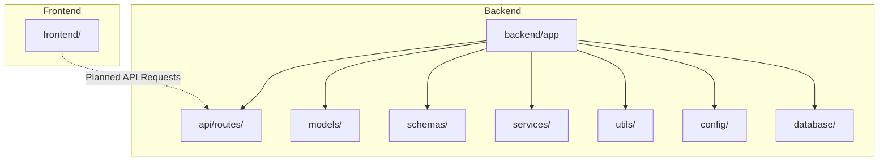

# Smart Tourist Safety - Codebase Documentation

This document provides a comprehensive overview of the **Smart-Tourist-Safety** codebase. It is designed to act as a canonical reference for developers and AI agents to understand, modify, debug, and extend the project.

---

# 1. Project Overview

* **Project Name**: Smart Tourist Safety
* **Purpose**: A Smart India Hackathon (SIH) project workspace initialized to build a system for tourist safety.
* **Main Functionality**: Currently in a bootstrapping/scaffolding state. No functional logic is yet implemented.
* **Technologies/Frameworks/Languages Used**: 
  * Inferred Backend: Python (FastAPI/Flask-like layout with `app`, `models`, `schemas`, `routes`, `services`, `utils` subdirectories).
  * Inferred Frontend: Web client application layout.
* **Important External Services**: None integrated yet.
* **Database Technology**: None integrated yet.
* **Deployment Environment**: None identified.

---

# 2. Complete File Tree

Below is the complete directory structure of the repository, excluding the `.git/` metadata directory.

```text
Smart-Tourist-Safety/
├── .gitignore
├── README.md/
│   └── .gitkeep
├── docs/
│   └── .gitkeep
├── frontend/
│   └── .gitkeep
└── backend/
    ├── app/
    │   ├── api/
    │   │   └── routes/
    │   │       └── .gitkeep
    │   ├── config/
    │   │   └── .gitkeep
    │   ├── database/
    │   │   └── .gitkeep
    │   ├── models/
    │   │   └── .gitkeep
    │   ├── schemas/
    │   │   └── .gitkeep
    │   ├── services/
    │   │   └── .gitkeep
    │   └── utils/
    │       └── .gitkeep
    └── tests/
        └── .gitkeep
```

*Note: `README.md` is currently a directory containing a `.gitkeep` placeholder, rather than a file.*

---

# 3. Architecture

The codebase is structured as a decoupled client-server application, though it is currently in an empty scaffolding state:



* **Frontend**: Housed in the `frontend/` directory. Currently empty.
* **Backend**: Housed in the `backend/` directory. The structure under `backend/app/` suggests a modular Python backend application (typically FastAPI) with distinct separation of concerns:
  * **Routing**: API endpoints mapped in `routes/`.
  * **Business Logic**: Encapsulated in `services/`.
  * **Data Validation**: Schemas (such as Pydantic models) mapped in `schemas/`.
  * **Persistence**: ORM models in `models/` and database configuration in `database/`.
* **Database**: None configured.
* **Authentication/Authorization**: None implemented.
* **AI/ML Components**: None implemented.
* **External Services**: None integrated.

---

# 4. Directory-by-Directory Explanation

### Root Directory
* **`.git/`**: Git version control metadata (excluded from file tree).
* **`docs/`**: Intended for project documentation.
* **`README.md/`**: Currently configured as a directory rather than a file. Contains a placeholder.
* **`frontend/`**: Intended for the frontend web application source code.
* **`backend/`**: Intended for the backend application source code and test suite.

### Backend Directory (`backend/`)
* **`backend/tests/`**: Intended for backend unit, integration, and functional test files.
* **`backend/app/`**: Root package for the backend application.
  * **`backend/app/api/routes/`**: Contains endpoint route definitions and controllers.
  * **`backend/app/config/`**: Intended for configuration loaders and settings (e.g., using Pydantic Settings).
  * **`backend/app/database/`**: Intended for database session setup, engine initialization, and migrations.
  * **`backend/app/models/`**: Intended for database entity models (e.g., SQLAlchemy or SQLModel classes).
  * **`backend/app/schemas/`**: Intended for request/response serialization and validation schemas (e.g., Pydantic).
  * **`backend/app/services/`**: Intended for core business rules and helper services (e.g., SMS, geolocation, risk analysis).
  * **`backend/app/utils/`**: Intended for general utility functions (e.g., date helpers, cryptography).

---

# 5. File-by-File Documentation

### `.gitignore`
* **File Path**: `/.gitignore`
* **Purpose**: Specifies files and directories that Git should ignore.
* **Main Responsibilities**: Excludes Python virtual environment directories (`venv/`, `.venv/`, `env/`) from version control.
* **Imports/Dependencies**: None.
* **Inputs/Outputs**: N/A
* **Endpoints**: None.
* **Database Interactions**: None.
* **Relationships**: Excludes local run-time environments for both backend and frontend development.

### Placeholder Files (`.gitkeep`)
* **File Paths**: 
  * `/docs/.gitkeep`
  * `/README.md/.gitkeep`
  * `/frontend/.gitkeep`
  * `/backend/tests/.gitkeep`
  * `/backend/app/api/routes/.gitkeep`
  * `/backend/app/config/.gitkeep`
  * `/backend/app/database/.gitkeep`
  * `/backend/app/models/.gitkeep`
  * `/backend/app/schemas/.gitkeep`
  * `/backend/app/services/.gitkeep`
  * `/backend/app/utils/.gitkeep`
* **Purpose**: Temporary files used to force Git to track and maintain empty directories.
* **Main Responsibilities**: Preserves directory scaffold structure.

---

# 6. Code Structure

There is no functional source code (classes, functions, React components, hooks, controllers, middleware, or models) currently defined in this repository.

---

# 7. Database Architecture

No database is configured, initiated, or utilized. There are no tables, collections, relationships, ORMs, or schema migrations.

---

# 8. API Documentation

No API endpoints are exposed or implemented.

---

# 9. Frontend Architecture

No frontend code, frameworks, state-management libraries, style sheets, or client-side assets are initialized.

---

# 10. Backend Architecture

No server entry point (such as `main.py` or `wsgi.py`), routes, middleware, or controllers are implemented.

---

# 11. Configuration & Environment

There are no active configuration files, settings classes, or environment variable files (`.env`). The `.gitignore` is prepared to exclude virtual environments.

---

# 12. Dependencies

No project dependency manifests (such as `requirements.txt`, `Pipfile`, `pyproject.toml`, or `package.json`) exist in the codebase.

---

# 13. Data Flow

No data flows exist as there is no operational code.

---

# 14. Development & Execution

No installation, build, test, execution, or deployment commands are currently defined in the codebase.

---

# 15. Important Conventions

The structure established in the `backend/app` directory suggests the following design patterns are intended:
* **Separation of Concerns**: Division of logic into models (persistence), schemas (validation), routes (delivery/API), and services (business logic).
* **Modular Routing**: Grouping of endpoints under `api/routes/`.
* **Testing**: Separation of tests into a dedicated `/backend/tests` folder.

---

# 16. Known Issues / TODOs

* **Scaffold Only**: The codebase is completely empty of functional code. No features, database integrations, frontend logic, or APIs exist.
* **README.md is a Directory**: The standard `README.md` is currently initialized as a directory instead of a markdown file.

---

# 17. Modification Guide

When starting implementation:

* **To implement the backend server**: Create `main.py` inside `backend/app/`.
* **To add API endpoints**: Create route files under `backend/app/api/routes/`.
* **To configure database settings**: Implement session configuration in `backend/app/database/` and models under `backend/app/models/`.
* **To add validation models**: Define schemas in `backend/app/schemas/`.
* **To implement business logic**: Write services in `backend/app/services/`.
* **To set up dependencies**: Add a `requirements.txt` or `pyproject.toml` in `backend/` and `package.json` in `frontend/`.
* **To start the frontend**: Initialize a React/Next.js/Vite project in `frontend/`.

---

# 18. AI Instructions / Rules

## AI CODEBASE RULES

Use these rules whenever this documentation is provided to an AI alongside the project:

1. Treat this document as the canonical architectural reference for the project.
2. Read and understand the existing architecture before making changes.
3. Do not unnecessarily rewrite, restructure, or refactor unrelated parts of the codebase.
4. Preserve existing APIs, database relationships, naming conventions, and architectural patterns unless a change explicitly requires modifying them.
5. Before changing a file, check how that file is connected to the rest of the system.
6. Do not invent dependencies, files, APIs, database tables, environment variables, or functionality.
7. Do not expose or reproduce secrets, API keys, passwords, tokens, or credentials.
8. When making a change, identify all files that may be affected by that change.
9. Keep changes minimal and compatible with the existing architecture unless the user explicitly requests a redesign.
10. If the requested change conflicts with the documented architecture, explain the conflict before making a major architectural change.
11. After making changes, verify that imports, references, APIs, database relationships, and configuration remain consistent.
12. Update this documentation only when explicitly authorized by the user.
13. **NEVER modify, overwrite, regenerate, or delete this `.md` documentation file unless the user explicitly gives permission to modify it.**
14. If the codebase changes but permission to update this documentation has not been given, leave this file untouched and inform the user that the documentation may now be outdated.
15. Never assume permission to modify this documentation simply because other project files are being modified.

## IMPORTANT IMMUTABILITY RULE

This `.md` file is a **protected documentation artifact**.

**DO NOT MODIFY THIS FILE WITHOUT EXPLICIT USER PERMISSION.**

The user must explicitly authorize changes to this documentation before it can be edited.

If the user says something like:

* "update the documentation"
* "refresh the architecture"
* "regenerate the codebase md"
* "update the file tree"

then permission has been granted for that specific documentation update.

Otherwise, treat the file as **read-only**.
