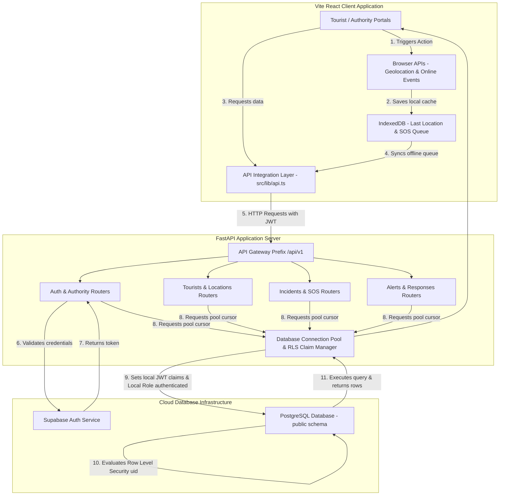

# Suraksha Setu Integration Blueprint: Frontend-Backend-Database Connection Guide

This document maps the user interactions and interface elements of the **Suraksha Setu (Smart Tourist Safety)** frontend application to their corresponding FastAPI backend routes, schemas, and Supabase/PostgreSQL database tables.

---

## 1. Documentation & References Summary
This integration guide is compiled by analyzing the following project documents and the actual live codebase:
* **[`DATABASE.md`](file:///Users/anishsingh/Documents/GitHub/Smart-Tourist-Safety/DATABASE.md):** The PostgreSQL schema database contract. It specifies Row Level Security (RLS) settings, primary identifiers (UUIDs), and constraints.
* **[`databasetobackend.md`](file:///Users/anishsingh/Documents/GitHub/Smart-Tourist-Safety/databasetobackend.md):** The document describing how FastAPI simulates RLS using `ThreadedConnectionPool` and `set_config('request.jwt.claims', ...)` before routing queries.
* **[`codebase.md`](file:///Users/anishsingh/Documents/GitHub/Smart-Tourist-Safety/codebase.md):** Structural information regarding frontend components and backend routers.
* **Active Codebase Files:** The implementation files under `/frontend/src` and `/backend` were directly scanned to identify current functions, schemas, endpoints, and data shapes.

---

## 2. Frontend Codebase Walkthrough

This section maps every interactive page, view, and component in the React TypeScript frontend application to its structural metadata, collected variables, and current integration state.

### 2.1 Gateway View
* **File Path:** [`Gateway.tsx`](file:///Users/anishsingh/Documents/GitHub/Smart-Tourist-Safety/frontend/src/components/Gateway.tsx)
* **Component Name:** `Gateway`

| UI Element Name | Current Function / Handler | Data Collected | Data Displayed | Expected User Action | Backend Connection Status |
| :--- | :--- | :--- | :--- | :--- | :--- |
| **"Public Mobile App" Card** | `onSelectRole('tourist')` | None | App description & features | Click card to enter Tourist Portal | ✅ None required (Client-side routing) |
| **"MFA Restricted Access" Card** | `setShowMfaModal(true)` | None | Command center features | Click card to open MFA login popup | ✅ None required (Client-side trigger) |
| **MFA Form (Badge ID Input)** | Local state `badgeId` | `badgeId` (string) | Default demo value: `IPS-7742` | Input officer badge ID | ❌ Mocked. Needs login connection |
| **MFA Form (Auth Code Input)** | Local state `otp` | `otp` (string) | Default demo value: `789012` | Input 2FA/OTP code | ❌ Mocked. Needs login connection |
| **"Verify Credentials & Log In" Button** | `handleMfaSubmit(e)` | `badgeId`, `otp` | Verification status | Submit form to authenticate authority | ❌ Mocked. Calls `onAuthenticateAuthority` |

---

### 2.2 Tourist Portal
* **File Path:** [`TouristPortal.tsx`](file:///Users/anishsingh/Documents/GitHub/Smart-Tourist-Safety/frontend/src/components/TouristPortal.tsx)
* **Component Name:** `TouristPortal`

| UI Element Name | Current Function / Handler | Data Collected | Data Displayed | Expected User Action | Backend Connection Status |
| :--- | :--- | :--- | :--- | :--- | :--- |
| **Registration Form: Full Name** | Local state `fullName` | `fullName` (string) | Input value | Input tourist's legal name | 🔵 Database & API support exist, frontend is mock |
| **Registration Form: Email** | Local state `email` | `email` (string) | Input value | Input tourist's email address | 🔵 Database & API support exist, frontend is mock |
| **Registration Form: Phone** | Local state `phone` | `phone` (string) | Input value | Input phone with country code | 🔵 Database & API support exist, frontend is mock |
| **Registration Form: Emergency Name** | Local state `emergencyContactName` | `emergencyContactName` (string) | Input value | Input emergency contact name | 🔵 Database & API support exist, frontend is mock |
| **Registration Form: Relation** | Local state `emergencyRelation` | `emergencyRelation` (string) | Selected option | Select relation (Father, Spouse, etc.) | 🔵 Database & API support exist, frontend is mock |
| **Registration Form: Emergency Phone** | Local state `emergencyContactPhone` | `emergencyContactPhone` (string) | Input value | Input emergency phone number | 🔵 Database & API support exist, frontend is mock |
| **"Verify DigiLocker" Button** | `handleConnectDigiLocker()` | None | Loading simulation | Trigger DigiLocker verification | 🔵 Database & API support exist, frontend is mock |
| **"Grant Consent" Button** | `handleConfirmDigiLocker()` | `digiLockerVerified = true` | Verified status checkbox | Confirm verified profile retrieval | 🔵 Database & API support exist, frontend is mock |
| **"Register & Generate ID" Button** | `handleSignUpSubmit()` | Renders OTP modal | Form valid status | Trigger sign-up verification | 🔵 Database & API support exist, frontend is mock |
| **Sign-In Form: Tourist ID** | Local state `signinTouristId` | `signinTouristId` (string) | Input value (Default: `TR-88219`) | Enter unique registered ID | 🔵 Database & API support exist, frontend is mock |
| **Sign-In Form: Phone** | Local state `signinPhone` | `signinPhone` (string) | Input value (Default: `+34...`) | Enter registered phone | 🔵 Database & API support exist, frontend is mock |
| **"Sign-In Verification" Button** | `handleSignInSubmit()` | Opens OTP modal | Verification triggers | Trigger sign-in check | 🔵 Database & API support exist, frontend is mock |
| **OTP Verification Button** | `handleVerifyOtp()` | `otpValue` (string) | Verification status / error | Submit code to confirm session | 🔵 Database & API support exist, frontend is mock |
| **"Copy ID" Button** | `handleCopyTouristId()` | None | "Copied" toast popup | Copies the UUID string | ✅ None (Client-side clipboard API) |
| **"Download PDF Pass" Button** | `handleDownloadPass()` | None | "Downloaded" toast status | Triggers PDF document generation | 🔵 Database exists but PDF gen is frontend mock |
| **"Location Consent" Button** | `handleGrantConsent()` | `locationConsent = 'granted'` | Updates user profile state | Opt-in to location GPS sharing | 🔵 Database profile supports it, api binding mock |
| **"Decline Consent" Button** | `handleDeclineConsent()` | `locationConsent = 'declined'` | Updates user profile state | Opt-out of location GPS sharing | 🔵 Database profile supports it, api binding mock |
| **"SOS PANIC" Button** | `handleStartSosConfirmation()` | None | SOS active confirmation prompt | Click to initiate emergency countdown | ✅ Connected (UI trigger) |
| **"CONFIRM EMERGENCY TRIGGER"** | `handleExecuteSosSend(false)` | Coordinates, battery, address | Progress bar percentage, incident ID | Click to instantly dispatch SOS signal | ✅ Connected (Calls API & IndexedDB) |
| **"SIMULATE SIGNAL FAILURE"** | `handleExecuteSosSend(true)` | Offline state simulation | Error message on signal drop | Simulates offline queuing functionality | ✅ Connected (Calls IndexedDB local queue) |
| **"CANCEL SOS & MARK SAFE"** | `handleResetSosFlow()` | Reset local SOS states | Resets UI dashboard back to green | Resolves the active SOS state | 🔵 DB & API exist (needs PATCH incident status) |
| **"Audio Siren Alert" Toggle** | Local state `sirenPlaying` | Plays loop sound | Siren activation status | Toggles audible phone siren | ✅ None (Client-side audio API) |
| **"Add Destination" Form** | `handleAddItinerary()` | `newDest`, `newDate`, `newHotel`, `newActivities` | Input fields | Submit new destination to route planner | 🔵 DB table exists but API and Frontend integration missing |
| **"Delete Destination" Button** | `handleDeleteItinerary(id)` | Selected itinerary item ID | Deletes card from view | Delete item from itinerary list | 🔵 DB table exists but API and Frontend integration missing |
| **"Send chatbot text" Button** | `handleSendMessage()` | `chatInput` (string) | Chat bubble messages | Send message to AI tourist safety assistant | 🔴 Backend and API missing (Frontend mock) |
| **"Trigger Weather Alert" Button** | `handleTriggerSimulatedAlert()`| None | Warning notification box | Triggers notification banner simulation | 🔵 DB table & API exist, Frontend mock |
| **"Log Out" Button** | `handleSignOut()` | Clears authenticated session | Returns page to Gateway | Destroys current local session | 🔵 DB & API exist, Frontend mock |

---

### 2.3 Authority command modules

#### A. AI Anomaly & Threat Predictor (ModuleAIHub)
* **File Path:** [`ModuleAIHub.tsx`](file:///Users/anishsingh/Documents/GitHub/Smart-Tourist-Safety/frontend/src/components/ModuleAIHub.tsx)
* **Component Name:** `ModuleAIHub`

| UI Element Name | Current Function / Handler | Data Collected | Data Displayed | Expected User Action | Backend Connection Status |
| :--- | :--- | :--- | :--- | :--- | :--- |
| **"Investigate" Button** | `onInvestigateCluster(cluster)`| Redirects to tracking tab | Selected cluster ID | Auto-fills tourist profile query search | 🔴 Backend and API missing (Frontend mock) |
| **"Dispatch Patrol Units" Button** | `onNavigateToMap()` | Redirects to SOS map tab | None | Instantly switch view to dispatcher map | ✅ None (Client-side navigation) |

#### B. Tourist Interception & Profile Tracking (ModuleTouristTracking)
* **File Path:** [`ModuleTouristTracking.tsx`](file:///Users/anishsingh/Documents/GitHub/Smart-Tourist-Safety/frontend/src/components/ModuleTouristTracking.tsx)
* **Component Name:** `ModuleTouristTracking`

| UI Element Name | Current Function / Handler | Data Collected | Data Displayed | Expected User Action | Backend Connection Status |
| :--- | :--- | :--- | :--- | :--- | :--- |
| **"Search Tourist" Input** | Local state `searchInput` | `searchInput` (string) | Input value | Enter target Tourist ID/Name | 🔵 DB & API exist, Frontend is local state lookup |
| **"Search" Button** | `triggerSearch(searchInput)` | Opens interception modal | Search state triggers | Intercept and inspect tourist profile | 🔵 DB & API exist, Frontend mock |
| **"Verify Interception" Button**| `handleConfirmInterception()`| Reason, notes | Records lookup event to audit log | Logs officer lookup reason, opens profile | 🔵 DB & API exist, Frontend logs locally |
| **"Mark Tourist Safe" Button** | `onMarkSafe(touristId)` | Updates safetyStatus to Safe | Renders profile green | Resolves tourist state manually | 🔵 DB & API exist (requires incident status patch) |
| **"Dispatch Unit" Button** | `onDispatchToTourist(tourist)` | Redirects to SOS map tab | None | Navigate to dispatch a responder unit | ✅ None (Client-side redirection) |
| **"Send SMS Broadcast" Button** | `onSendSmsToTourist(tourist)` | Redirects to Broadcast tab | None | Navigate to push geofence SMS alert | ✅ None (Client-side redirection) |

#### C. Live GIS SOS Map & Dispatch Ticketing (ModuleSOSMap)
* **File Path:** [`ModuleSOSMap.tsx`](file:///Users/anishsingh/Documents/GitHub/Smart-Tourist-Safety/frontend/src/components/ModuleSOSMap.tsx)
* **Component Name:** `ModuleSOSMap`

| UI Element Name | Current Function / Handler | Data Collected | Data Displayed | Expected User Action | Backend Connection Status |
| :--- | :--- | :--- | :--- | :--- | :--- |
| **"SOS Beacons" Toggle** | `setShowSosLayer()` | Toggles visible markers | Active incident dots | Hide/show incident layers on GIS map | ✅ None (Client-side state filter) |
| **"Responders" Toggle** | `setShowRespondersLayer()`| Toggles visible markers | Patrolling unit dots | Hide/show police PCR layers on GIS map | ✅ None (Client-side state filter) |
| **"Police Stations" Toggle** | `setShowStationsLayer()` | Toggles visible markers | Station dots | Hide/show police office layers on GIS map | ✅ None (Client-side state filter) |
| **"Hospitals" Toggle** | `setShowHospitalsLayer()` | Toggles visible markers | Hospital clinic dots | Hide/show ambulance layers on GIS map | ✅ None (Client-side state filter) |
| **"Heatmap" Toggle** | `setShowHeatmapLayer()` | Toggles visible markers | Crowd density zones | Hide/show risk color overlays on GIS map | ✅ None (Client-side state filter) |
| **"Dispatch Unit" Selector** | `onDispatchUnit(ticketId, val)`| Selected unit ID | Assigned unit badge | Assign responder unit to active incident | 🔵 DB exists, API exists (needs response INSERT) |
| **"Resolve Case" Button** | `onResolveIncident(ticketId)`| Selected incident ID | Case status updates | Mark dispatch ticket resolved and closed | 🔵 DB exists, API exists (needs incident status patch) |
| **"Simulate SOS" Button** | `onAddMockSos()` | Generates random incident | New card on board | Triggers mock SOS ticket for testing | ✅ None (Dev tool simulation helper) |

#### D. Geofenced Emergency SMS Broadcast (ModuleBroadcast)
* **File Path:** [`ModuleBroadcast.tsx`](file:///Users/anishsingh/Documents/GitHub/Smart-Tourist-Safety/frontend/src/components/ModuleBroadcast.tsx)
* **Component Name:** `ModuleBroadcast`

| UI Element Name | Current Function / Handler | Data Collected | Data Displayed | Expected User Action | Backend Connection Status |
| :--- | :--- | :--- | :--- | :--- | :--- |
| **Broadcast Form Fields** | Local state variables | Region, radius, severity, titles, message body | Form input values | Fill out emergency advisory details | 🔵 DB & API exist, Frontend is mock |
| **"Publish Broadcast" Button** | `handlePublish(e)` | Drafted alert fields | Sends alert status toast | Pushes broadcast notification to region | 🔵 DB & API exist, Frontend mock |

#### E. Command Audit Trail & Performance Metrics (ModuleAnalyticsAudit)
* **File Path:** [`ModuleAnalyticsAudit.tsx`](file:///Users/anishsingh/Documents/GitHub/Smart-Tourist-Safety/frontend/src/components/ModuleAnalyticsAudit.tsx)
* **Component Name:** `ModuleAnalyticsAudit`

| UI Element Name | Current Function / Handler | Data Collected | Data Displayed | Expected User Action | Backend Connection Status |
| :--- | :--- | :--- | :--- | :--- | :--- |
| **Search/Action Filter** | Local state filters | Filter string, Action Type | Refined log list | Refine visible rows of audit actions | ✅ None (Client-side filter) |
| **"Export Compliance CSV"** | `exportCsv()` | Complete state audit log | Triggers CSV download | Downloads compliance log file | 🔴 Backend and DB tables missing (Frontend mock) |

---

## 3. Backend API Route Walkthrough

All backend routes are prefix-mounted at `/api/v1` and handle SQL transactions directly against the PostgreSQL/Supabase database using connection cursors.

### 3.1 Authentication Router (`backend/routers/auth.py`)
* **Prefix:** `/auth`
* **Tags:** `auth`

* **`POST /api/v1/auth/register`**
  * **HTTP Method:** `POST`
  * **Purpose:** Registers a tourist or authority user in the database. Wires registration directly to Supabase Auth API (`/auth/v1/signup`) and inserts profiles.
  * **Authentication:** None (Public).
  * **Request Body Schema (`RegisterRequest`):** `{ "username", "password", "user_type", "tourist_id", "authority_id", "mfa_enabled" }`
  * **Expected Response (`AuthResponse`):** `{ "auth_id", "tourist_id", "authority_id", "username", "user_type", "mfa_enabled", "last_login_at", "created_at" }`
  * **Database Tables Involved:** `public.tourists` (INSERT for tourist), `public.authorities` (INSERT for authority), `public.authentication` (INSERT linking profile).
  * **Database Operation:** INSERT.
  * **Related Frontend Functionality:** Tourist Portal registration signup form submit (`handleSignUpSubmit` -> `handleVerifyOtp`).

* **`POST /api/v1/auth/login`**
  * **HTTP Method:** `POST`
  * **Purpose:** Signs in user and returns JWT. Communicates with Supabase Auth API (`/auth/v1/token?grant_type=password`) to retrieve token, and updates user's last login timestamp.
  * **Authentication:** None (Public).
  * **Request Body Schema (`LoginRequest`):** `{ "username", "password" }`
  * **Expected Response (`LoginResponse`):** `{ "access_token", "token_type", "auth_id", "username", "user_type", "tourist_id", "authority_id", "mfa_enabled", "last_login_at" }`
  * **Database Tables Involved:** `public.authentication` (SELECT profile details, UPDATE `last_login_at`).
  * **Database Operation:** SELECT, UPDATE.
  * **Related Frontend Functionality:** Tourist Sign-In form submit (`handleSignInSubmit`), Authority MFA validation form submit (`handleMfaSubmit`).

* **`POST /api/v1/auth/logout`**
  * **HTTP Method:** `POST`
  * **Purpose:** Terminates user session. Calls Supabase logout endpoint (`/auth/v1/logout`) using Authorization headers.
  * **Authentication:** Required (Bearer Token / X-Session-Token).
  * **Request Headers:** `Authorization: Bearer <JWT_TOKEN>`
  * **Expected Response:** `{ "message": "logged out" }`
  * **Database Tables Involved:** None.
  * **Database Operation:** None.
  * **Related Frontend Functionality:** Sign Out button (`handleSignOut`).

* **`GET /api/v1/auth/session`**
  * **HTTP Method:** `GET`
  * **Purpose:** Fetches current session details of user extracted from decoded JWT headers.
  * **Authentication:** Required (Bearer Token / X-Session-Token).
  * **Expected Response (`SessionResponse`):** `{ "auth_id", "auth_user_id", "username", "user_type", "tourist_id", "authority_id", "mfa_enabled", "last_login_at" }`
  * **Database Tables Involved:** `public.authentication` (SELECT user profile details by `auth_user_id`).
  * **Database Operation:** SELECT.
  * **Related Frontend Functionality:** App start initialization session recovery checks.

---

### 3.2 Tourists Router (`backend/routers/tourists.py`)
* **Prefix:** `/tourists`
* **Tags:** `tourists`

* **`POST /api/v1/tourists`**
  * **HTTP Method:** `POST`
  * **Purpose:** Creates a new profile record for the authenticated tourist.
  * **Authentication:** Required (Bearer Token).
  * **Request Body Schema (`TouristCreate`):** `{ "full_name", "digital_id", "kyc_document_type", "kyc_verified", "phone", "email", "emergency_contact", "preferred_language" }`
  * **Expected Response (`TouristResponse`):** `{ "tourist_id", "digital_id", "full_name", "kyc_document_type", "kyc_verified", "phone", "email", "emergency_contact", "preferred_language", "created_at" }`
  * **Database Tables Involved:** `public.tourists` (INSERT profile record), `public.authentication` (UPDATE profile link reference `tourist_id`).
  * **Database Operation:** INSERT, UPDATE.
  * **Related Frontend Functionality:** Tourist Registration Flow (`handleVerifyOtp`).

* **`GET /api/v1/tourists/{tourist_id}`**
  * **HTTP Method:** `GET`
  * **Purpose:** Retrieves the profile of a tourist. Protects query using current user's authenticated cursor (RLS policy check).
  * **Authentication:** Required (Bearer Token).
  * **Expected Response (`TouristResponse`):** Same schema as POST.
  * **Database Tables Involved:** `public.tourists`.
  * **Database Operation:** SELECT.
  * **Related Frontend Functionality:** Tourist portal profile dashboard loading.

* **`GET /api/v1/tourists/{tourist_id}/digital-id`**
  * **HTTP Method:** `GET`
  * **Purpose:** Returns the verified digital passport/ID profile card details.
  * **Authentication:** Required (Bearer Token).
  * **Expected Response (`DigitalIdResponse`):** `{ "tourist_id", "digital_id", "full_name", "kyc_document_type", "kyc_verified" }`
  * **Database Tables Involved:** `public.tourists`.
  * **Database Operation:** SELECT.
  * **Related Frontend Functionality:** Digital Pass modal display in tourist app.

* **`PATCH /api/v1/tourists/{tourist_id}`**
  * **HTTP Method:** `PATCH`
  * **Purpose:** Updates selective fields of the tourist's profile (e.g., phone, emergency contact, preferred language, KYC details).
  * **Authentication:** Required (Bearer Token).
  * **Request Body Schema (`TouristUpdate`):** Partial update model containing any subset of profile fields.
  * **Expected Response (`TouristResponse`):** Same schema as GET.
  * **Database Tables Involved:** `public.tourists`.
  * **Database Operation:** UPDATE.
  * **Related Frontend Functionality:** Connecting DigiLocker (`handleConfirmDigiLocker`) or updating contact settings.

---

### 3.3 Incidents Router (`backend/routers/incidents.py`)
* **Prefix:** `/incidents`
* **Tags:** `incidents`

* **`POST /api/v1/incidents`**
  * **HTTP Method:** `POST`
  * **Purpose:** Generates a non-SOS incident report (e.g. theft, assault). Automatically resolves/creates a location entry in `public.locations` from parameters.
  * **Authentication:** Required (Bearer Token).
  * **Request Body Schema (`IncidentCreate`):** `{ "tourist_id", "location_id", "latitude", "longitude", "incident_type", "severity", "status", "description", "authority_id" }`
  * **Expected Response (`IncidentResponse`):** `{ "incident_id", "tourist_id", "location_id", "incident_type", "severity", "status", "description", "created_at", "authority_id" }`
  * **Database Tables Involved:** `public.tourists` (SELECT validation), `public.locations` (INSERT if coordinates provided), `public.incidents` (INSERT incident ticket).
  * **Database Operation:** SELECT, INSERT.
  * **Related Frontend Functionality:** Incident reports filed from user portal.

* **`GET /api/v1/incidents`**
  * **HTTP Method:** `GET`
  * **Purpose:** Lists active incident files assigned to or created by the user (filtered by RLS). Includes optional status filter.
  * **Authentication:** Required (Bearer Token).
  * **Request Parameters:** Query param: `status` (string, optional).
  * **Expected Response:** `list[IncidentResponse]`
  * **Database Tables Involved:** `public.incidents`.
  * **Database Operation:** SELECT.
  * **Related Frontend Functionality:** Authority Live Kanban Board display.

* **`GET /api/v1/incidents/{incident_id}`**
  * **HTTP Method:** `GET`
  * **Purpose:** Retrieves detailed parameters of a single incident.
  * **Authentication:** Required (Bearer Token).
  * **Expected Response (`IncidentResponse`):** Same schema as POST.
  * **Database Tables Involved:** `public.incidents`.
  * **Database Operation:** SELECT.
  * **Related Frontend Functionality:** Incident card selection detail inspection.

* **`PATCH /api/v1/incidents/{incident_id}`**
  * **HTTP Method:** `PATCH`
  * **Purpose:** Updates incident details (e.g. status transition from OPEN to RESPONDING, changing severity, appending responder units).
  * **Authentication:** Required (Bearer Token).
  * **Request Body Schema (`IncidentUpdate`):** `{ "status", "severity", "description" }`
  * **Expected Response (`IncidentResponse`):** Updated incident model.
  * **Database Tables Involved:** `public.incidents`.
  * **Database Operation:** UPDATE.
  * **Related Frontend Functionality:** Dispatching PCR Unit (`onDispatchUnit`) or resolving incident (`onResolveIncident`).

---

### 3.4 SOS Router (`backend/routers/sos.py`)
* **Prefix:** `/sos`
* **Tags:** `sos`

* **`POST /api/v1/sos`**
  * **HTTP Method:** `POST`
  * **Purpose:** Processes incoming high-severity SOS alarms. Automatically spawns a geocoded location, writes an incident ticket of type `"SOS"` with status `"OPEN"`, and inserts an activation event row.
  * **Authentication:** Required (Bearer Token).
  * **Request Body Schema (`SOSCreate`):** `{ "tourist_id", "location_id", "latitude", "longitude", "description", "severity", "trigger_source" }`
  * **Expected Response (`SOSResponse`):** `{ "sos_id", "tourist_id", "incident_id", "location_id", "incident_type", "severity", "status", "description", "triggered_at", "created_at", "trigger_source", "sos_status" }`
  * **Database Tables Involved:** `public.tourists` (SELECT check), `public.locations` (INSERT geocoded coordinate point), `public.incidents` (INSERT incident record), `public.sos_requests` (INSERT activation record).
  * **Database Operation:** SELECT, INSERT.
  * **Related Frontend Functionality:** Tourist portal emergency panic button confirmation (`handleExecuteSosSend`).

---

### 3.5 Alerts Router (`backend/routers/alerts.py`)
* **Prefix:** `/alerts`
* **Tags:** `alerts`

* **`POST /api/v1/alerts`**
  * **HTTP Method:** `POST`
  * **Purpose:** Creates a notification alert linked to an active incident.
  * **Authentication:** Required (Bearer Token).
  * **Request Body Schema (`AlertCreate`):** `{ "incident_id", "channel", "recipient", "sent_at" }`
  * **Expected Response (`AlertResponse`):** `{ "alert_id", "incident_id", "channel", "recipient", "sent_at" }`
  * **Database Tables Involved:** `public.incidents` (SELECT verify), `public.alerts` (INSERT notification log).
  * **Database Operation:** SELECT, INSERT.
  * **Related Frontend Functionality:** Pushing emergency broadcast alerts to specific users.

* **`GET /api/v1/alerts`**
  * **HTTP Method:** `GET`
  * **Purpose:** Lists alerts filtered by RLS policies or specific incident filter.
  * **Authentication:** Required (Bearer Token).
  * **Request Parameters:** Query param: `incident_id` (UUID, optional).
  * **Expected Response:** `list[AlertResponse]`
  * **Database Tables Involved:** `public.alerts`.
  * **Database Operation:** SELECT.
  * **Related Frontend Functionality:** Alert notification logs display.

---

### 3.6 Locations Router (`backend/routers/locations.py`)
* **Prefix:** `/locations`
* **Tags:** `locations`

* **`GET /api/v1/locations`**
  * **HTTP Method:** `GET`
  * **Purpose:** Retrieves the list of recorded coordinate log points and tourist safety positions.
  * **Authentication:** Required (Bearer Token).
  * **Expected Response:** `list[LocationResponse]` (returns `{ "location_id", "name", "latitude", "longitude", "risk_level", "recorded_at" }`)
  * **Database Tables Involved:** `public.locations`.
  * **Database Operation:** SELECT.
  * **Related Frontend Functionality:** Displaying pins on Live GIS Map and Crowd Risk Heatmaps.

* **`GET /api/v1/locations/{location_id}`**
  * **HTTP Method:** `GET`
  * **Purpose:** Fetches metadata details of a specific coordinate location record.
  * **Authentication:** Required (Bearer Token).
  * **Expected Response (`LocationResponse`):** Location attributes.
  * **Database Tables Involved:** `public.locations`.
  * **Database Operation:** SELECT.
  * **Related Frontend Functionality:** Geocoding lookup rendering.

---

### 3.7 Authority Operations Router (`backend/routers/authority.py`)
* **Prefix:** `/authority`
* **Tags:** `authority`

* **`POST /api/v1/authority/login`**
  * **HTTP Method:** `POST`
  * **Purpose:** Authenticates authority personnel. Restricts login to accounts labeled with `'authority'` role types.
  * **Authentication:** None (Public).
  * **Request Body Schema (`LoginRequest`):** `{ "username", "password" }`
  * **Expected Response (`LoginResponse`):** Standard auth credentials.
  * **Database Tables Involved:** `public.authentication` (SELECT, UPDATE).
  * **Database Operation:** SELECT, UPDATE.
  * **Related Frontend Functionality:** Authority command dashboard entrance validation.

* **`GET /api/v1/authority/alerts`**
  * **HTTP Method:** `GET`
  * **Purpose:** Lists all alerts dispatchers have permission to access.
  * **Authentication:** Required (Authority Role Guard).
  * **Expected Response:** `list[AlertResponse]`
  * **Database Tables Involved:** `public.alerts`.
  * **Database Operation:** SELECT.
  * **Related Frontend Functionality:** National command center alert logs panel.

* **`GET /api/v1/authority/incidents`**
  * **HTTP Method:** `GET`
  * **Purpose:** Returns the complete list of incidents within the authority's scope.
  * **Authentication:** Required (Authority Role Guard).
  * **Expected Response:** `list[IncidentResponse]`
  * **Database Tables Involved:** `public.incidents`.
  * **Database Operation:** SELECT.
  * **Related Frontend Functionality:** Incidents list / active ticket panels in command app.

* **`GET /api/v1/authority/tourists/{tourist_id}`**
  * **HTTP Method:** `GET`
  * **Purpose:** Accesses demographic and contact records of a specific tourist for tracking purposes.
  * **Authentication:** Required (Authority Role Guard).
  * **Expected Response (`TouristResponse`):** Tourist profile attributes.
  * **Database Tables Involved:** `public.tourists`.
  * **Database Operation:** SELECT.
  * **Related Frontend Functionality:** Tourist interception detail inspector dashboard.

* **`GET /api/v1/authority/incidents/{incident_id}/location`**
  * **HTTP Method:** `GET`
  * **Purpose:** Resolves and returns the geocoded location detail attributes linked to the active incident.
  * **Authentication:** Required (Authority Role Guard).
  * **Expected Response (`LocationResponse`):** Geocoded details.
  * **Database Tables Involved:** `public.incidents` (SELECT `location_id`), `public.locations` (SELECT parameters).
  * **Database Operation:** SELECT.
  * **Related Frontend Functionality:** Telemetry rendering on Live Map.

---

## 4. Database Schema & Entity Relationships

This relational mapping corresponds to the PostgreSQL schema tables in the public schema on Supabase.

```text
                        ┌────────────────────────┐
                        │       auth.users       │
                        └───────────┬────────────┘
                                    │
            ┌───────────────────────┼──────────────────────┐
            │ (1:1)                 │ (1:1)                │ (1:1)
            ▼                       ▼                      ▼
┌──────────────────────┐┌──────────────────────┐┌──────────────────────┐
│   public.tourists    ││  public.authorities  ││public.authentication │
├──────────────────────┤├──────────────────────┤├──────────────────────┤
│ PK: tourist_id       ││ PK: authority_id     ││ PK: auth_id          │
│ FK: auth_user_id     ││ FK: auth_user_id     ││ FK: auth_user_id     │
│                      ││                      ││ FK: tourist_id (opt) │
│                      ││                      ││ FK: authority_id(opt)│
└───────────┬──────────┘└───────────┬──────────┘└──────────────────────┘
            │                       │
            ├─────────────┐         ├─────────────┐
            │ (1:N)       │ (1:N)   │ (1:N)       │ (1:N)
            ▼             ▼         ▼             ▼
┌───────────┴──────────┐┌───────────┴──────────┐┌──────────────────────┐
│  itinerary_entries   ││   public.incidents   ││   public.responses   │
├──────────────────────┤├──────────────────────┤├──────────────────────┤
│ PK: itinerary_id     ││ PK: incident_id      ││ PK: response_id      │
│ FK: tourist_id       ││ FK: tourist_id       ││ FK: incident_id      │
│ FK: location_id (PK) ││ FK: location_id      ││ FK: authority_id     │
│                      ││ FK: authority_id     ││                      │
└──────────────────────┘└───────────┬──────────┘└──────────────────────┘
                                    │
                                    ├─────────────┐
                                    │ (1:N)       │ (1:N)
                                    ▼             ▼
                        ┌───────────┴──────────┐┌──────────────────────┐
                        │    public.alerts     ││ public.sos_requests  │
                        ├──────────────────────┤├──────────────────────┤
                        │ PK: alert_id         ││ PK: sos_id           │
                        │ FK: incident_id      ││ FK: tourist_id       │
                        │                      ││ FK: incident_id      │
                        │                      ││ FK: location_id      │
                        └──────────────────────┘└──────────────────────┘
```

### 4.1 Row Level Security (RLS) & Query Context Wires
The backend database operations run in a transaction context. When queries run under an active user token:
1. `db.py` sets the session variable `request.jwt.claims` to match the authenticated user's ID (`sub`) and role (`authenticated`).
2. RLS policies intercept the statement.
3. RLS policies evaluate `auth.uid()` against `tourists.auth_user_id` or `authorities.auth_user_id` to permit SELECT/INSERT/UPDATE commands.

---

## 5. Connection Map Lifecycles

This section visualizes the data flow pathways from frontend user events down to the database transactions.

### 5.1 Tourist Registration & Account Creation Flow
```text
User enters name, email, phone & clicks "Register & Generate ID"
                           ↓
              TouristPortal.tsx: handleSignUpSubmit()
                           ↓
        TouristPortal.tsx: handleVerifyOtp() (OTP validation)
                           ↓
  POST /api/v1/auth/register (payload: RegisterRequest models)
                           ↓
        auth.py: register() API Route handler
                           ↓
   Calls Supabase Auth API: /auth/v1/signup (Creates Auth record)
                           ↓
                Receives auth_user_id (UUID)
                           ↓
             INSERT INTO public.tourists (profile record)
             INSERT INTO public.authentication (link record)
                           ↓
      API response returned to client (AuthResponse schemas)
                           ↓
       TouristPortal.tsx opens digital safety pass dashboard
```

### 5.2 Tourist Emergency SOS Flow (Offline-First Sync)
```text
Tourist presses "SOS EMERGENCY PANIC" (Confirm Trigger Action)
                           ↓
          TouristPortal.tsx: handleExecuteSosSend()
                           ↓
       Resolves GPS coordinates (navigator.geolocation API)
                           ↓
     Local DB: queueSOSRecord() (Saves backup copy to IndexedDB)
                           ↓
                 Checks if network is active:
        [ONLINE]                              [OFFLINE]
            │                                     │
            ▼                                     ▼
POST /api/v1/sos (submitSOSOnline)       Queued in IndexedDB
            │                             (Shows offline status)
            ▼                                     │
   sos.py: create_sos()                           │
            │                                     │
INSERT INTO public.locations (coordinates)        │
INSERT INTO public.incidents (type='SOS')         │
INSERT INTO public.sos_requests (ACTIVE)          │
            │                                     │
      API returns OK                              │
            │                                     │
            ▼                                     ▼
TouristPortal updates SOS Status      Re-establishes internet signal
            │                                     │
            │                                     ▼
            │                        online window event triggers
            │                                     │
            │                                     ▼
            │                         api.ts: syncQueuedSOS() runs
            │                                     │
            │                             POST /api/v1/sos
            │                                     │
            │                                     ▼
            │                         UPDATE IndexedDB -> SYNCED
            ▼                                     ▼
           National Emergency Center receives incident tickets
```

### 5.3 Authority Dispatch PCR Unit Flow
```text
Dispatcher views Kanban board & selects responder unit in dropdown
                           ↓
            ModuleSOSMap.tsx: onDispatchUnit()
                           ↓
                  App.tsx: handleDispatchUnit()
                           ↓
PATCH /api/v1/incidents/{id} (payload: { "status": "RESPONDING" })
                           ↓
      incidents.py: update_incident() route handler
                           ↓
  UPDATE public.incidents SET status = 'RESPONDING', authority_id = ...
  INSERT INTO public.responses (responder_unit, action_taken)
                           ↓
                     API returns OK
                           ↓
      Map redraws unit route tracking indicator in real-time
```

---

## 6. Unified Connection Integration Matrix

This matrix classifies the current integration status of every frontend-to-backend linkage.

* ✅ **Already connected:** Complete frontend interface to backend API and database pipeline.
* ⚠️ **Partially connected:** Endpoint or database structure exists, but API parameters are not fully integrated.
* ❌ **Not connected:** Elements are mock-only in the UI, but API and DB schemas are prepared.
* 🔴 **Backend missing:** The UI expects a function, but no router, schema, or endpoint exists in the backend.
* 🟡 **Frontend implementation missing:** API endpoint exists on the backend, but the frontend lacks a UI element to call it.
* 🔵 **Database support exists but API connection is missing:** Table structure is defined in SQL, but no endpoint links it.

| Frontend View / Component | Trigger Event | Backend Route | Method | Database Table | Status |
| :--- | :--- | :--- | :---: | :--- | :---: |
| **Gateway Auth** | Click Log In as Authority | `/api/v1/authority/login` | POST | `public.authentication` | ❌ Not connected |
| **Tourist Auth** | Submit Registration Sign-Up | `/api/v1/auth/register` | POST | `public.tourists`, `public.authentication` | ❌ Not connected |
| **Tourist Auth** | Submit Tourist Login Form | `/api/v1/auth/login` | POST | `public.authentication` | ❌ Not connected |
| **Tourist Auth** | Click Sign Out | `/api/v1/auth/logout` | POST | None | ❌ Not connected |
| **Tourist Portal** | Fetch active login profile | `/api/v1/tourists/{id}` | GET | `public.tourists` | ❌ Not connected |
| **Tourist Portal** | Fetch digital safety pass | `/api/v1/tourists/{id}/digital-id` | GET | `public.tourists` | ❌ Not connected |
| **Tourist Portal** | Update KYC DigiLocker details | `/api/v1/tourists/{id}` | PATCH | `public.tourists` | ❌ Not connected |
| **Tourist Portal** | Trigger SOS Panic Action | `/api/v1/sos` | POST | `public.locations`, `public.incidents`, `public.sos_requests` | ✅ Already connected |
| **Tourist Portal** | Add destination to route planner | `/api/v1/itineraries` *(Proposed)* | POST | `public.itinerary_entries` | 🔵 Database exists, API missing |
| **Tourist Portal** | Remove destination itinerary | `/api/v1/itineraries/{id}` *(Proposed)*| DELETE | `public.itinerary_entries` | 🔵 Database exists, API missing |
| **Tourist Portal** | Message Safety AI Chatbot | `/api/v1/ai/chat` *(Proposed)* | POST | None | 🔴 Backend missing |
| **Tourist Portal** | Get weather safety alerts | `/api/v1/alerts` | GET | `public.alerts` | ❌ Not connected |
| **AI Command Hub** | Render risk anomalies & logs | `/api/v1/ai/anomalies` *(Proposed)* | GET | None | 🔴 Backend missing |
| **Tourist Tracking**| Search tourist ID profiles | `/api/v1/authority/tourists/{id}` | GET | `public.tourists` | ❌ Not connected |
| **Tourist Tracking**| Log statutory interception event| `/api/v1/audit-logs` *(Proposed)*| POST | `public.audit_logs` *(Proposed)* | 🔴 Backend missing |
| **Tourist Tracking**| Toggle tourist state to Safe | `/api/v1/incidents/{id}` | PATCH | `public.incidents` | ❌ Not connected |
| **Live SOS Map** | Fetch active dispatch tickets | `/api/v1/authority/incidents` | GET | `public.incidents` | ❌ Not connected |
| **Live SOS Map** | Dispatch PCR unit responder | `/api/v1/incidents/{id}` | PATCH | `public.incidents`, `public.responses` | ⚠️ Partially connected |
| **Live SOS Map** | Mark SOS ticket as Resolved | `/api/v1/incidents/{id}` | PATCH | `public.incidents`, `public.responses` | ⚠️ Partially connected |
| **SMS Broadcast** | Geofence emergency alert push | `/api/v1/alerts` | POST | `public.alerts` | ❌ Not connected |
| **Command Audit** | View officer lookup trails | `/api/v1/audit-logs` *(Proposed)* | GET | `public.audit_logs` *(Proposed)* | 🔴 Backend missing |

---

## 7. Interactive Buttons & Actions Dictionary

Detailed specifications for important interactive elements in the frontend application that require server connection.

### 7.1 "Verify Security Credentials & Log In" (Tourist OTP verification)
* **File Path:** [`TouristPortal.tsx`](file:///Users/anishsingh/Documents/GitHub/Smart-Tourist-Safety/frontend/src/components/TouristPortal.tsx)
* **Component:** `TouristPortal`
* **Trigger Function:** `handleVerifyOtp()`
* **Expected Result:** Validates registration or sign-in credentials, establishes a JWT session, and loads the user profile dashboard.
* **Data Payload Required:** `{ "username": fullName, "password": phone_otp_signature }` (mapped to backend requirements).
* **Target Endpoint:** `/api/v1/auth/login` or `/api/v1/auth/register` (depending on `otpPendingAction` state).
* **HTTP Method:** `POST`
* **Backend Handler:** `login()` / `register()` in `backend/routers/auth.py`
* **Database Tables:** `public.authentication` (SELECT, INSERT), `public.tourists` (INSERT).
* **API Response Shape:** `LoginResponse` or `AuthResponse`.
* **State Updates:** Sets `authenticatedUser` profile states and initializes session headers.

### 7.2 "Confirm DigiLocker Document Verification" (Tourist KYC)
* **File Path:** [`TouristPortal.tsx`](file:///Users/anishsingh/Documents/GitHub/Smart-Tourist-Safety/frontend/src/components/TouristPortal.tsx)
* **Component:** `TouristPortal`
* **Trigger Function:** `handleConfirmDigiLocker()`
* **Expected Result:** Commits verified Aadhaar / Passport verification attributes to the tourist's profile database record.
* **Data Payload Required:** `{ "kyc_document_type": "AADHAAR", "kyc_verified": true }`
* **Target Endpoint:** `/api/v1/tourists/{tourist_id}`
* **HTTP Method:** `PATCH`
* **Backend Handler:** `update_tourist()` in `backend/routers/tourists.py`
* **Database Tables:** `public.tourists` (UPDATE).
* **API Response Shape:** `TouristResponse`.
* **State Updates:** Sets local state `digiLockerVerified` to `true` and renders the identity badge as verified.

### 7.3 "Cancel SOS Signal & Mark as Safe"
* **File Path:** [`TouristPortal.tsx`](file:///Users/anishsingh/Documents/GitHub/Smart-Tourist-Safety/frontend/src/components/TouristPortal.tsx)
* **Component:** `TouristPortal`
* **Trigger Function:** `handleResetSosFlow()`
* **Expected Result:** Resolves the emergency SOS alert status and returns the tourist safety status indicator back to green ("Safe").
* **Data Payload Required:** `{ "status": "RESOLVED" }`
* **Target Endpoint:** `/api/v1/incidents/{incident_id}`
* **HTTP Method:** `PATCH`
* **Backend Handler:** `update_incident()` in `backend/routers/incidents.py`
* **Database Tables:** `public.incidents` (UPDATE).
* **API Response Shape:** `IncidentResponse`.
* **State Updates:** Renders dashboard status back to green, clears flashing alert siren status, and resets variables.

### 7.4 "Confirm Destination Addition" (Itinerary Route Planner)
* **File Path:** [`TouristPortal.tsx`](file:///Users/anishsingh/Documents/GitHub/Smart-Tourist-Safety/frontend/src/components/TouristPortal.tsx)
* **Component:** `TouristPortal`
* **Trigger Function:** `handleAddItinerary()`
* **Expected Result:** Inserts a planned travel destination record linked to the tourist's itinerary checklist.
* **Data Payload Required:** `{ "tourist_id", "location_name", "latitude", "longitude", "planned_arrival", "planned_departure" }`
* **Target Endpoint:** `/api/v1/itineraries` *(Proposed)*
* **HTTP Method:** `POST`
* **Backend Handler:** Missing. Requires creation of a new router mapping `public.itinerary_entries`.
* **Database Tables:** `public.itinerary_entries` (INSERT), `public.locations` (SELECT/INSERT).
* **API Response Shape:** `{ "itinerary_id", "tourist_id", "location_id", "planned_arrival", "planned_departure" }`
* **State Updates:** Appends the new destination card into the scrollable itinerary timeline container.

### 7.5 "Verify Identity & Fetch Telemetry" (Authority Interception Search)
* **File Path:** [`ModuleTouristTracking.tsx`](file:///Users/anishsingh/Documents/GitHub/Smart-Tourist-Safety/frontend/src/components/ModuleTouristTracking.tsx)
* **Component:** `ModuleTouristTracking`
* **Trigger Function:** `handleConfirmInterception()`
* **Expected Result:** Authenticates lookup authorization, logs lookup reasons for compliance, and renders GPS coordinate parameters.
* **Data Payload Required:** Query parameter `tourist_id` or `name` search query.
* **Target Endpoint:** `/api/v1/authority/tourists/{tourist_id}`
* **HTTP Method:** `GET`
* **Backend Handler:** `get_authority_tourist_details()` in `backend/routers/authority.py`
* **Database Tables:** `public.tourists` (SELECT), `public.authentication` (SELECT).
* **API Response Shape:** `TouristResponse`.
* **State Updates:** Sets state `selectedTourist` to profile response data and centers map coordinates on the tourist.

### 7.6 "Dispatch Responding PCR" (Kanban Unit Assignment)
* **File Path:** [`ModuleSOSMap.tsx`](file:///Users/anishsingh/Documents/GitHub/Smart-Tourist-Safety/frontend/src/components/ModuleSOSMap.tsx)
* **Component:** `ModuleSOSMap`
* **Trigger Function:** `onDispatchUnit(ticketId, unitId)`
* **Expected Result:** Transitions incident status to "Responding" or "Units Dispatched" and logs assigned responder units.
* **Data Payload Required:** `{ "status": "INVESTIGATING", "authority_id": selected_authority_id }`
* **Target Endpoint:** `/api/v1/incidents/{incident_id}`
* **HTTP Method:** `PATCH`
* **Backend Handler:** `update_incident()` in `backend/routers/incidents.py`
* **Database Tables:** `public.incidents` (UPDATE), `public.responses` (INSERT tracking record).
* **API Response Shape:** `IncidentResponse`.
* **State Updates:** Moves incident ticket card to the "Dispatched" column on the Kanban board and updates maps.

---

## 8. Forms & Data Flow Specifications

Detailed mapping of registration, login, and regional broadcasting forms.

### 8.1 Tourist Signup Registration Form
* **Component Location:** [`TouristPortal.tsx`](file:///Users/anishsingh/Documents/GitHub/Smart-Tourist-Safety/frontend/src/components/TouristPortal.tsx) (Lines 756–860)

```text
 ┌────────────────────────────────────────────────────────┐
 │   Input Field     │   Type    │       Validation       │
 ├───────────────────┼───────────┼────────────────────────┤
 │ Full Name         │ text      │ Required. min length 2 │
 │ Email             │ email     │ Required. Email check  │
 │ Phone Number      │ tel       │ Required. Tel check    │
 │ Emergency Contact │ text      │ Required               │
 │ Relationship      │ select    │ Dropdown choice        │
 │ Emergency Phone   │ tel       │ Required. Tel check    │
 └───────────────────┴───────────┴────────────────────────┘
```
* **JSON Payload Shape:**
  ```json
  {
    "username": "Elena Rostova",
    "password": "+34612884902", 
    "user_type": "tourist",
    "mfa_enabled": false
  }
  ```
* **Transmission target:** `POST /api/v1/auth/register`
* **Database Destination:**
  * Credentials -> `auth.users`
  * Tourist metadata -> `public.tourists` (inserts name, email, phone, emergency contact details).
  * System mapping -> `public.authentication` (inserts link records).
* **Success UI Feedback:** Opens OTP modal for verification. On successful code verification, renders Digital Pass Modal containing the tourist safety ID.
* **Failure UI Feedback:** Renders validation message or collision errors in red alert boxes above registration fields.

### 8.2 Authority Geofence Broadcast Alert Form
* **Component Location:** [`ModuleBroadcast.tsx`](file:///Users/anishsingh/Documents/GitHub/Smart-Tourist-Safety/frontend/src/components/ModuleBroadcast.tsx) (Lines 88–180)

```text
 ┌────────────────────────────────────────────────────────┐
 │   Input Field     │   Type    │       Validation       │
 ├───────────────────┼───────────┼────────────────────────┤
 │ Region Selector   │ select    │ Required selection     │
 │ Radius (KM)       │ range     │ Numeric value (1-50)   │
 │ Severity Level    │ select    │ Choice options         │
 │ Alert Title (EN)  │ text      │ Required. max 100 chars│
 │ Alert Title (HI)  │ text      │ Optional               │
 │ Message Body (EN) │ textarea  │ Required. max 500 chars│
 │ Message Body (HI) │ textarea  │ Optional               │
 └───────────────────┴───────────┴────────────────────────┘
```
* **JSON Payload Shape:**
  ```json
  {
    "incident_id": "8f7a9d1b-3c4e-4f52-a1b2-c3d4e5f67890", 
    "channel": "SMS",
    "recipient": "Geofence Broadcast: Kullu Sector (10km)",
    "sent_at": "2026-08-14T00:00:00Z"
  }
  ```
  *(Note: The database requires alerts to link to an incident. A default parent placeholder incident representing regional hazard advisories is used).*
* **Transmission target:** `POST /api/v1/alerts`
* **Database Destination:** `public.alerts` table (INSERT).
* **Success UI Feedback:** Renders green "Emergency Alert Broadcasted" bounce banner detailingestimated audience size, and adds entry to historical timeline.
* **Failure UI Feedback:** Renders red advisory banner showing dispatch error.

---

## 9. Authentication & Session Flow Blueprint

Detailed overview of the authentication setup across the application stack.

```text
       [ Tourist / Authority Client ]
                    │
                    ▼  (Inputs credentials / badge codes)
         POST /api/v1/auth/login
                    │
                    ▼
     [ FastAPI routers/auth.py handler ]
                    │
                    ▼  (Requests verification validation)
     Supabase Auth API (/auth/v1/token)
                    │
                    ├─► [ Valid: Returns JWT Access Token ]
                    │
                    ▼
   [ Save Token locally in Client Storage ]
      localStorage.setItem("sos_auth_token", token)
                    │
                    ▼  (Subsequent authenticated API Requests)
    Headers: { Authorization: "Bearer <token>" }
                    │
                    ▼
      [ FastAPI Dependency: get_current_user ]
  decodes JWT claim "sub" & fetches profile from public.authentication
                    │
                    ▼
     [ get_authenticated_cursor(auth_user_id) ]
    Simulates role 'authenticated' inside transaction
                    │
                    ▼
       [ PostgreSQL Row Level Security (RLS) ]
        Filters tables: SELECT WHERE auth_user_id = auth.uid()
```

---

## 10. Real-time SOS, Geolocation & Offline Synchronization

The SOS panic feature operates on an offline-first system to maintain reliable operation across remote areas.

### 10.1 Geolocation Acquisition Lifecycle
1. The app queries the browser `navigator.geolocation` via `getSOSLocation()`.
2. Coordinates are stored in IndexedDB (`smart_tourist_safety_sos` database, `last_location` store) every time position is successfully updated.
3. If GPS resolution fails (e.g. canopy interference), the app retrieves coordinates from the `last_location` cache.

### 10.2 IndexedDB Outbox Queue
* When SOS countdown completes, a record is constructed:
  * Key: `local_sos_id` (UUID string).
  * Payload fields: tourist_id, latitude, longitude, triggered_at, severity, status (`"QUEUED_OFFLINE"`).
* The record is written to the `sos_queue` store inside IndexedDB via `queueSOSRecord()`.

### 10.3 Auto-Sync Daemon
```text
                     [ Internet Disconnect Event ]
                                   │
                                   ▼
                   Tourist Portal displays offline status
                                   │
                                   ▼
             User regains mobile service network signal
                                   │
                                   ▼
                  Browser fires event 'online'
                                   │
                                   ▼
             TouristPortal.tsx calls syncQueuedSOS()
                                   │
                                   ▼
                Reads "QUEUED_OFFLINE" records from IndexedDB
                                   │
                                   ▼
             Loops and calls submitSOSOnline() for each
                                   │
                                   ├─► [ POST /api/v1/sos ]
                                   │
                                   ▼
                 Receives server incident identifiers
                                   │
                                   ▼
           Updates status of IndexedDB record to "SYNCED"
```

---

## 11. Missing / Required Connections Directory

The following gaps exist between frontend features and the database/API layer. This list defines the integration requirements for future development.

### 11.1 Tourist Itinerary Route Planner Integration
* **Feature:** Destination Itinerary Management.
* **Frontend File:** [`TouristPortal.tsx`](file:///Users/anishsingh/Documents/GitHub/Smart-Tourist-Safety/frontend/src/components/TouristPortal.tsx)
* **Frontend Functions:** `handleAddItinerary()` and `handleDeleteItinerary()`
* **Required Backend Endpoints:**
  * `POST /api/v1/itineraries` (create itinerary item)
  * `GET /api/v1/itineraries?tourist_id={id}` (list itinerary items)
  * `DELETE /api/v1/itineraries/{itinerary_id}` (delete itinerary item)
* **Required Backend Router:** `backend/routers/itinerary.py`
* **Database Table:** `public.itinerary_entries`
* **Required Request Payload Shape:** `{ "tourist_id", "location_name", "latitude", "longitude", "planned_arrival", "planned_departure" }`
* **Expected Response Shape:** `{ "itinerary_id", "tourist_id", "location_id", "planned_arrival", "planned_departure" }`
* **Frontend UI Update:** Appends/removes destinations from the itinerary timeline view in real-time.
* **Implementation Priority:** **High** (Core feature mapped to existing DB tables).

### 11.2 Authority Statutory Interception Audit Logging
* **Feature:** Audit Logs for officer lookup tracking.
* **Frontend File:** [`ModuleTouristTracking.tsx`](file:///Users/anishsingh/Documents/GitHub/Smart-Tourist-Safety/frontend/src/components/ModuleTouristTracking.tsx)
* **Frontend Function:** `handleConfirmInterception()`
* **Required Backend Endpoint:** `POST /api/v1/audit-logs`
* **Required Backend Router:** `backend/routers/audit.py`
* **Database Table:** `public.audit_logs` (Needs creation. The database currently lacks this table).
* **Required Request Payload:** `{ "officer_badge", "target_tourist_id", "interception_reason", "notes", "ip_address" }`
* **Expected Response:** `{ "audit_id", "timestamp", "logged" }`
* **Frontend UI Update:** Appends security logs into `ModuleAnalyticsAudit` dashboard and clears interception modal.
* **Implementation Priority:** **Medium** (Required to support government compliance logging).

### 11.3 Safety AI Chatbot Assistant Integration
* **Feature:** AI Chatbot Widget.
* **Frontend File:** [`TouristPortal.tsx`](file:///Users/anishsingh/Documents/GitHub/Smart-Tourist-Safety/frontend/src/components/TouristPortal.tsx)
* **Frontend Function:** `handleSendMessage()`
* **Required Backend Endpoint:** `POST /api/v1/ai/chat`
* **Required Backend Router:** `backend/routers/ai.py`
* **Database Table:** None required (External LLM API integration / session history).
* **Required Request Payload:** `{ "tourist_id", "message", "session_id" }`
* **Expected Response:** `{ "response_text", "suggested_actions" }`
* **Frontend UI Update:** Renders typing bubble indicator, followed by the assistant text bubble.
* **Implementation Priority:** **Low** (Helper utility feature).

### 11.4 Emergency PCR Response Dispatch Logger
* **Feature:** Recording responders dispatched.
* **Frontend File:** [`ModuleSOSMap.tsx`](file:///Users/anishsingh/Documents/GitHub/Smart-Tourist-Safety/frontend/src/components/ModuleSOSMap.tsx)
* **Frontend Function:** `onDispatchUnit()`
* **Required Backend Endpoint:** `POST /api/v1/incidents/{incident_id}/responses`
* **Required Backend Router:** `backend/routers/incidents.py`
* **Database Table:** `public.responses` (Table exists in DB schema, but lacks endpoints).
* **Required Request Payload:** `{ "responder_unit", "action_taken", "authority_id" }`
* **Expected Response:** `{ "response_id", "incident_id", "responder_unit", "action_taken", "authority_id" }`
* **Frontend UI Update:** Renders dispatcher unit assigned tag status on incident cards.
* **Implementation Priority:** **High** (P0 Incident management lifecycle requirement).

---

## 12. Recommended Implementation Roadmap

This sequence details the order in which missing integrations should be implemented, structured to minimize dependency blockers.

1. **Phase 1: Authentication & Authorization Integration**
   * Link Tourist Registration Form (`handleSignUpSubmit`) and Login Form (`handleSignInSubmit`) to `/api/v1/auth/register` and `/api/v1/auth/login`.
   * Hook up Authority Login credentials check on Gateway to `/api/v1/authority/login`.
   * Save JWT token inside `localStorage` and wire axios/fetch interceptors to pass headers on requests.

2. **Phase 2: Profile Telemetry & KYC**
   * Map DigiLocker consent validation to `PATCH /api/v1/tourists/{id}` to write verified Aadhaar / Passport information.
   * Bind Tourist Interception Search tool on the authority page to `/api/v1/authority/tourists/{tourist_id}` instead of mock state array filter.

3. **Phase 3: Incident Lifecycle & Dispatching**
   * Create `public.responses` API endpoints.
   * Wire PCR Unit dispatch dropdown selection to trigger `POST /api/v1/incidents/{id}/responses` and `PATCH /api/v1/incidents/{id}` (updating status to `RESPONDING`).
   * Bind "Resolve Case" click action to patch incident status to `RESOLVED` on the server.

4. **Phase 4: Itinerary planner**
   * Create itinerary entries routers and schemas in FastAPI.
   * Bind Route planner add/delete handlers on the client side.

5. **Phase 5: Broadcasting & Compliance Logging**
   * Hook up Geofence Broadcast publisher fields to `/api/v1/alerts`.
   * Initialize audit logging database tables and bind interception confirmation prompts to log events.

---

## 13. System Architecture Diagram


